Sample Questions

Wednesday, April 5, 2017

12:32 PM

 

# Question 4

> 

  - > Equivalence occurs at 40.0 ml titrant added. So half equivalence
    > at 20.0 ml of titrant.

  - > At half equivalence, \[HA\]=\[A-\]. Below half equivalence, more
    > acid species present.

> ![14 12 10 pKa2=7.19 8 6 4 2 pKa1 - 1.85 Titration of 40.00 mL of
> 0.1000 M H2S03 with 0.1000 MNaOH PH 9.86 at second equivalence (HSOÜ)
> = \[S032-\] legion pH 4.25 at first equivalence point tH2S03) \[HSOÜI
> Buffer regioC, 20 40 60 point 80 Volume of NaOH added (
> ](./media/image2.png)

# Question 8

> ![Kinetic Temperature The expression for gas pressure developed from
> kinetic theory relates pressure and volume to the average molecular
> kinetic energy. Comparison with the ideal gas law leads to an
> expression for sometimes referred to as the kinetic temperature. = —N
> —mv2 PV = nRT This leads to the expression 1 2 — mv 2 21 3k 1 2 2
> where N is the number of molecules, n the number of moles, R the gas
> constant, and k the Boltzmann constant. The more familiar form
> expresses the average molecular kinetic energy: 1\<Eavg 2 3 2 Show
> ](./media/image3.png)

# Question 19

> 

# Question 26

> 

# Question 25

  - > Larger ionic radius --\> smaller lattice energy --\> lower boiling
    > point

 

 

1999 Multiple Choice

2017年2月6日 星期一

下午 10:05

 

# Question 4

> ![计算机生成了可选文字: The principal reason ionic compounds are stable is the
> attraction between ions Of opposite charge. This attraction draws the
> ions together ， releasing energy and causing the ions to form a solid
> array ， or lattice ， such as that shown in Figure 8 ． 3 ． A measure of
> how much stabilization results 什 om arranging oppositely charged ions
> in an ionic solid is given by the lattice energy ， which is the “ “ 罗
> required co e 纱 separate 0 ” e mole Ofa solid io CO PO d 仂 its g eo io
> ． TO envision this process for NaCl, imagine that the structure in
> Figure 8 ． 3 expands from within ， SO that the distances between the
> ions increase until the ions are very far apart. This process requires
> 788 kJ/moI, which is the value of the lattice energy: NaC1(s) -- - 一 十
> (g) + Cl-(g) AHIattice = +788kJ/moI \[ 8 ． 3 \] ](./media/image6.png)
> 
> 

# Question 9-12

  - > Buffer
    
      - > Weak Acid + Its Congregate Base
    
      - > Weak Base + Its Congregate Acid

# Question 13-16

# Question 23

# Question 27

  - > A visible-light **spectrophotometer** can determine the
    > **concentration** of a solution

> 
> 
>  
> 
> 

# Question 30

# Question 31

> 

# Question 32

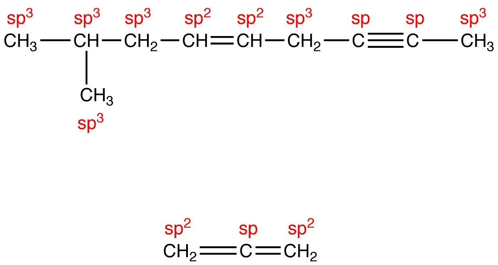

# Question 35

> 

# Question 38

# Question 39

  - > The **normal melting point** of a solid is defined as the
    > temperature at which the solid and liquid are in equilibrium at a
    > total pressure of 1 atmosphere.

# Question 43

  - > When **excess ammonia** is added to a solution of Cu(NO3)2, the
    > color of blue will be **darker**.

  - > Cu(NO3)2 + 4NH3 = \[Cu(NH3)4\]\](NO3)2

> 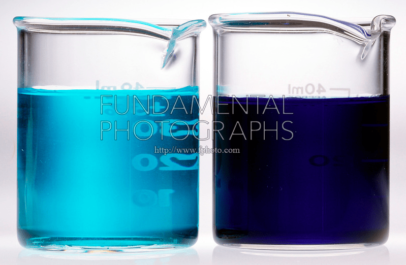

  - > Adding Ammonia To Copper II Nitrate.

  - > (left) Solution of blue Cu(NO3)2\*6H2O (complex ion is Cu(H2O)6
    > +2).

  - > (right) Addition of NH3(aq) forms deep blue complex ion
    > \[Cu(NH3)4(H2O)2\]2+.

# Question 53

> 
> 
> 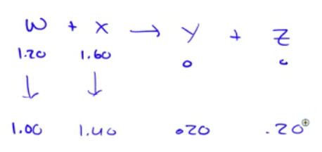

# Question 54

> 

# Question 56

> 

# Question 57

  - > The **standard reduction potential** is an **intrinsic** property.
    > It will **not change** by the coefficient.

# Question 63

![Zeroth Order First Order Second Order Differential rate law
Concentration vs. time Integrated rate law Straight-line plot to
determine rate constant Relative rate vs. concentration Half-life Units
of k, rate constant Rate = o o o o ALA\] At Time Slope = —k Time Rate —
o o ALA\] = MA\] At Time o o —kt or Slope = —k Time \[A\], M Rate, M/S o
o o o 2 3 M Rate, M/s 2k 2 3 Rate = 2 3 A\[A\] = At Time Slope = k Time
Rate, M/S 4 9 2 3 0.693 l/s ](./media/image22.png)

# Question 54

> 
> 
> 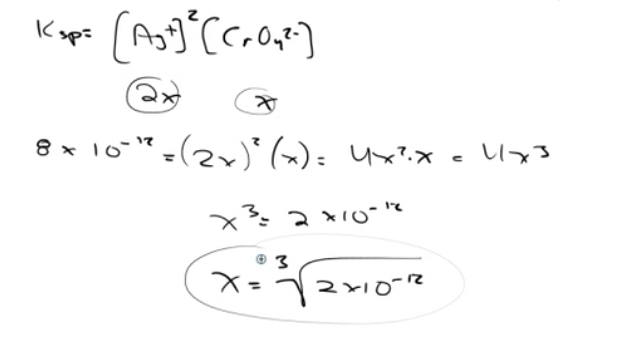

# Question 70

# Question 72

> 

# Question 74

  - > **SO2** is a **polar** molecule, so it will **deviate** from
    > **ideal**
> behavior.

> 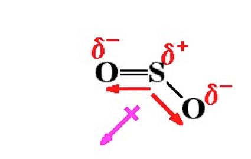

 

 

1999 Free Response

Sunday, April 2, 2017

9:19 PM

 

# Question 1 (c)

> ![Using Ka to Calculate pH Knowing the value of Ka and the initial
> concentration of a weak acid, we can calculate the concentration of
> H+(aq) in a solution of the acid. Lees calculate the pH at 25 oc of a
> 0.30 M solution of acetic acid (CH3COOH), the weak acid responsible
> for the charac- teristic odor and acidity of vinegar. 1. Our first
> step is to write the ionization equilibrium: CH3COOH(aq) H+(aq) +
> CH3COO (aq) \[16.28\] Notice that the hydrogen that ionizes is the one
> attached to an oxygen atom. 2. The second step is to write the
> equilibrium-constant expression and the value for the equilibrium
> constant. Taking Ka = 1.8 X 10 5 from Table 16.2, we write 5 = 1.8 x
> 10 \[CH3COOH\] \[16.29\] 3. The third step is to express the
> concentrations involved in the equilibrium reac- tion. This can be
> done with a little accounting, as described in Sample Exercise 16.10.
> Because we want to find the equilibrium value for l, let's call this
> quan- tity x. The concentration of acetic acid before any of it
> ionizes is 0.30 M. The chem- ical equation tells us that for each
> molecule of CH3COOH that ionizes, one H+(aq) and one CH3COO (aq) are
> formed. Consequently, if x moles per liter of H+(aq) form at
> equilibrium, x moles per liter of rnust also form and x moles per
> liter of CH3COOH rnust be ionized: ](./media/image28.png)
> 
> ![Initial concentration (M) Change in concentration (M) Equilibrium
> concentration (M) CH3COOH(aq) 0.30 —x (0.30 - x) H+(aq) x CH3COO (aq)
> x 4. The fourth step is to substitute the equilibrium concentrations
> into the equilibrium- constant expression and solve for x: 5 = 1.8 x
> 10 \[CH3COOH1 0.30 — x \[16.30\] This expression leads to a quadratic
> equation in x, which we can solve by using either an equation-solving
> calculator or the quadratic formula. We can simplify the problem,
> however, by noting that the value of Ka is quite small. As a result,
> we anticipate that the equilibrium lies far to the left and that x is
> much smaller than the initial concentration of acetic acid. Thus we
> assume that x is ne li ible relative to 0.30 so that 0.30 — x is
> essentiall e ual to 0.30. We can (and should\!) check the validity of
> this assumption when we finish the problem. By using this assumption,
> Equation 16.30 becomes — @ = 1.8 X 10 5 0.30 ](./media/image29.png)
> 
> 
> 
> ![Now we check the validity of our simplifying assumption that 0.30 —
> x 0.30. The value of x we determined is so small that, for this number
> of significant figures, the assumption is entirely valid. We are thus
> satisfied that the assumption was a reasonable one to make. Because x
> represents the moles per liter of acetic acid that ionize, we see
> that, in this particular case, less than 1% of the acetic acid
> molecules ionize: 0.0023 M Percent ionization of CH3COOH — x 100% =
> 0.77% 0.30 M As a general rule, if x is more than about 5% of the
> initial concentration value, it is better to use the quadratic
> formula. You should always check the validity of any simplifying
> assumptions after you have finished solving a problem. We have also
> made one other assumption, namely that all of the in the solution
> comes from ionization of CH3COOH. Are we justified in neglecting the
> autoionization of H20? The answer is yes—the additional \[H+\] due to
> water, which would be on the order of 10 7 M, is negligible compared
> to the \[H+\] from the acid (which in this case is on the order of 10
> 3 M). In extremely precise work, or in cases involving very dilute
> solutions of acids, we would need to consider the autoionization
> ofwater more fully. ](./media/image31.png)

# Question 1 (e)

> 
> 
> ![Solution containing weak acid Neutraliza tion reaction: \[HA\]
> decreases \[A — \] increases HA + OW A - + H20 Calculate new values of
> \[HA\] and \[A -1 Add strong base Use Ka, \[HA\], and \[A—I to
> calculate \[H +1 Equilibrium calculation pH Stoichiometry calculation
> A Figure 17.10 strong base. Procedure for calculating pH when a weak
> acid is partially neutralized by a
> ](./media/image33.png)
> 
> 
> 
> 

# Question 2 (b)

> 
> 
> 
> 
> ![The positive charge holding the electron is greater for He+, which
> has a 2+ nucleus, than for H with its 1+ nucleus. The stronger
> attraction means that it requires more energyl pt for the electron to
> move to higher energy levels. Therefore, transitions from high energy
> states to lower states will be more energetic for He + than for H.
> Note: Other arguments accepted, such as, "E is proportional to Z 2.
> Since Z = 2 for He and Z = 1 for H, all energy levels in He + are
> raised (by a factor of 4)." Other accepted answers must refer to the
> increased gharge on the He+ nucleus, and NOT the mass.
> ](./media/image38.png)

# Question 3 (b)

> ![Reaction Orders: The Exponents in the Rate Law The rate law for most
> reactions has the form Rate = k\[reactant 1 lmrreactant 21M ...
> \[14.8\] The exponents m and n are called reaction orders. For
> example, consider again the rate law for the reaction of NH4+ with N02
> Rate = Because the exponent of \[NH4+\] is 1, the rate is first order
> in NH4+. The rate is also first order in N02— . (The exponent 1 is not
> shown in rate laws.) The overall reaction order is the sum of the
> orders with respect to each reactant represented in the rate law.
> Thus, for the NH4+ — N02— reaction, the rate law has an overall
> reaction order of 1 + 1 = 2, and the reaction is second order overall.
> The exponents in a rate law indicate how the rate is affected by each
> reactant con- centration. Because the rate at which NH4+ reacts with
> N02— depends on C NH4+\] raised to the first power, the rate doubles
> when \[NH4+l doubles, triples when r NH4+l triples, and so forth.
> Doubling or tripling r N02— likewise doubles or triples the rate. If a
> rate law is second order with respect to a reactant, r A 12, then
> doubling the concentration of that substance causes the reaction rate
> to quadruple because \[212 = 4, whereas tripling the concentration
> causes the rate to increase ninefold: \[31 The following are some
> additional examples of experimentally determined rate laws: 2 N205(g)
> 4 N02(g) + 02(g) Rate = kCN205\] H2(g) + 12(g) 2 Hl(g) Rate = \[14.9\]
> \[14.10\] CHC13(g) + C12(g) CC14(g) + HC1(g) Rate = \[14.11\] Although
> the exponents in a rate law are sometimes the same as the coefficients
> in the balanced equation, this is not necessarily the case, as
> Equations 14.9 and 14.11 show. For any reaction, the rate law must be
> determined experimentally. In most rate laws, reac- tion orders are 0,
> 1, or 2. However, we also occasionally encounter rate laws in which
> the reaction order is fractional (as is the case with Equation 14.11)
> or even negative. ](./media/image39.png)
> 
> 

# Question 3 (d)

> ![Mechanisms with a Slow Initial Step We can most easily see the
> relationship between the slow step in a mechanism and the rate law for
> the overall reaction by considering an example in which the first step
> in a multistep mechanism is the rate-determining step. Consider the
> reaction of N02 and CO to produce NO and CO, (Equation 14.23). Below
> 225 oc, it is found experi- mentally that the rate law for this
> reaction is second order in NO, and zero order in CO: Rate = k\[N0212.
> Can we propose a reaction mechanism consistent with this rate law?
> Consider the two-step mechanism:\* N03(g) + NO(g) (slow) step 1:
> N02(g) + N02(g) Step 2: N03(g) + CO(g) N02(g) + C02(g) (fast) Overall:
> N02(g) + CO(g) NO(g) + C02(g) Step 2 is much faster than step 1; that
> is, k2 \>\> kl, telling us that the intermediate N03(g) is slowly
> produced in step 1 and immediately consumed in step 2. Because step 1
> is slow and step 2 is fast, step 1 is the rate-determining step. Thus,
> the rate of the overall reaction depends on the rate of step 1, and
> the rate law of the ](./media/image41.png)
> 
> ![overall reaction equals the rate law of step 1. Step 1 is a
> bimolecular process that has the rate law Rate = Thus, the rate law
> predicted by this mechanism agrees with the one observed experi-
> mentally. The reactant CO is absent from the rate law because it
> reacts in a step that follows the rate-determining step. A scientist
> would not, at this point, say that we have "proved" that this mecha-
> nism is correct. All we can say is that the rate law predicted by the
> mechanism is consistent with experiment. We can often envision a
> different sequence of steps that leads to the same rate law. If,
> however, the predicted rate law of the proposed mecha- nism disagrees
> with experiment, we know for certain that the mechanism cannot be
> correct. ](./media/image42.png)

# Question 5 (d)

> 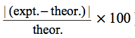

# Question 6 (b)

> ![(b) (i)The reaction rate depends on the reaction kinetics which is
> determined by the value of the activation energy, Eact. If the
> activation energy is large, a reaction that is thermodynamically
> spontaneous may proceed very slowly (if at all). One point eamed for
> linking the rate of the reaction to the activation energy, which may
> be explained verbally or shown on a reaction profile diagram (ii) The
> catalyst has no effect on the value of AGO. The catalyst reduces the
> value of Eact, increasing the rate of reaction, but has no effect on
> AHO and ASO, so it cannot affect the thermodynamics of the reaction.
> One point eamed for indicating no change in the value of AGO One point
> eamed for indicating (verbally, or with a reaction-profile diagram)
> that the catalyst affects the activation energy 1 pt 1 pt the values
> of 1 pt ](./media/image44.png)

# Question 7 (b)

> 

# Question 7 (c)

> 
> 
> 
> 
> 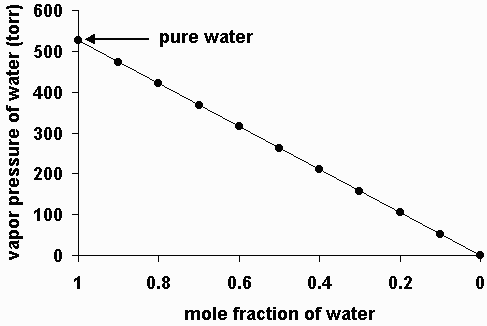

# Question 7 (d)

> 

# Question 8 (b)

> 

 

 

2008 Multiple Choice

2017年4月28日 星期五

下午10:38

 

# Question 10

> 
> 
> 

# Question 11

  - > Quantity typically determined by measuring the rate of a reaction
    > at two or more different temperatures: Activation Energy

  - > The activation energy can also be found algebraically by
    > substituting two rate constants (k1, k2) and the two corresponding
    > reaction temperatures (T1, T2) into the Arrhenius
> Equation

> 

  - > Arrhenius Equation

> ![actvaton energy consänt RT Kelvin temperature the gas consant
> frequency factor mathematca\] quantty, e pre-exponenta\] factor
> ](./media/image54.png)

# Question 49

  - > Most Phosphates are insoluble

> 

# Question 54

> 

  - > Raoult's law

> 
> 
> 

# Question 66

> 

  - > Collision Theory

> 
> 
> 
> 
> 
> 
> 
> 
> 
> 
> 

# Question 70

> 
> 
> 
> 
> 

 

 

2009 Multiple Choice

2017年4月28日 星期五

下午10:38

 

# Question 10

  - > Highest ionization energy: He

> 

# Question 11

  - > Ni2+ is light
> green

> 
> 
> 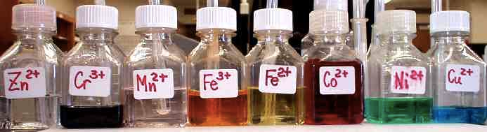

# Question 15

  - > Lewis acid-base reaction and coordination complex

> 
> 
> 

# Question 28

> 
> 
> 

# Question 34

  - > Hydrogen bonding in
> N2H4

> 

# Question 40

  - > Beta plus decay vs. Beta minus decay

> 

# Question 71

> 
> 
> 
> 
> 

 

 

2009 Free Response

2017年4月30日 星期日

下午1:18

 

# Question 1 (a)

  - > HOI is a weaker acid than HOCl

> ![(iii) Hypoiodous acid has the formula HOI. Predict whether HOI is a
> stronger acid or a weaker acid than the acid that you identified in
> part (a)(i). Justify your prediction in terms of chemical bonding. HOI
> is a weaker acid than HOCI because the O—H bond in HOI is stronger
> than the O—H One point is earned for predicting that HOI is a bond in
> HOCI. The lower electronegativitv weaker acid than HOCI and stating
> that iodine has a (electron-drawing ability) of I compared with lower
> electronegativity than chlorine and EITHER that of Cl results in an
> electron density that is higher (hence a bond that is stronger)
> between the H and O atoms in HOI compared with the electron density
> between the H and O atoms in HOCI. OR The conjugate base OCI- is more
> stable than OE because Cl, being more electronegative, is better able
> to accommodate the negative charge. • stating that this results in a
> stronger O—H bond in HOI OR • stating that this decreases the
> stability of the OE ion in solution. ](./media/image81.png)

  - > Inductive Effects

> ![Atoms or groups of atoms in a molecule other than those to which H
> is bonded can induce a change in the distribution of electrons within
> the molecule. This is called an inductive effect, and, much like the
> coordination of water to a metal ion, it can have a major effect on
> the acidity or basicity of the molecule. For example, the hypohalous
> acids (general formula HOX, with X representing a halogen) al have a
> hydrogen atom bonded to an oxygen atom. In aqueous solution, they all
> produce the following equil'brium: + OV(aq) IIOX@) The addities of
> these acids vary by about three orders of magnitude, electronegativity
> of the halogen atoms: HOX HOC HOBr HOI Electronegativity of X 3.0 2.8
> 2.5 (16.8.3) however, due to the difference in pKa 7.40 8.55 10.5 As
> the electronegativity of X increases, the distribution of electron
> density within the molecule changes: the electrons are drawn more
> strongly toward the halogen atom and, in turn, away from the H in the
> O—H bond, thus weaken•ng the O—H bond and allowing d"ssociation of
> hydrogen as H +. The acidity of oxoac•ds, with the general formula
> HOXOn (with n = 0—3), depends strongly on the number of terminal
> oxygen atoms attached to the central atom X. As shown in Figure
> 16.8.1, the Ka values of the oxoac•ds of chlorine increase by a factor
> of about 104 to 106 with each oxygen as successive oxygen atoms are
> added. The •ncrease in acid strength with increasing number of
> terminal oxygen atoms is due to both an inductive effect and increased
> stabilization of the conjugate base. ](./media/image82.png)
> 
> ![Because oxygen is the second most electronegative element, adding
> terminal oxygen atoms causes electrons to be drawn away from the O—H
> bond, making it weaker and thereby increasing the strength of the
> acid. The colors in Figure 16.8.1 show how the electrostatic
> potential, a measure of the strength of the interact•on of a point
> charge at any place on the surface of the molecule, changes as the
> number of terminal oxygen atoms increases. In Figure 16.8.1 and Figure
> 16.8.2, blue corresponds to low electron densities, while red
> corresponds to high electron densities. The oxygen atom in the O—H
> unit becomes steadily less red from HCIO to HC104 (aso written as
> HOC103, while the H atom becomes steadily bluer, •ndicating that the
> electron density' on the O—H unit decreases as the number of terminal
> oxygen atoms increases. The decrease in electron density in the O—H
> bond weakens it, making it easier to lose hydrogen as 11+ ions,
> thereby increasing the strength of the acid. ](./media/image83.png)
> 
> 

# Question 2 (e)

  - > Percent error is always positive

> 

# Question 3 (e)

> 
> 
> ![1 The order of the reaction with respect to C12 is \[Cl\]2 -z.
> \[Cl\] 1\<1/2 \[Cl \]1/2 For step 1, K - \[C121 Substituting into the
> rate law for step 2 (the slowest step in the mechanism): rate-
> k\[CH4\] \[Cl\] \[C12\]l/2) \[CH4\] \[C12\]l/2 Because the exponent of
> C12 in the rate law is 1/2, the order of the reaction with respect to
> C12 is 1/2. One point is earned for the correct answer with
> appropriate justification. ](./media/image87.png)

  - > Mechanisms with a Fast Initial Step

> ![Let's consider an alternative mechanism that does not involve a
> termolecular step: (fast) NO(g) + Bh(g) Step 1: step 2: NOBh(g) +
> NO(g) 2NOBr(g) (slow) \[14.27) In this mechanism, step 1 involves two
> processes: a forward reaction and its reverse. Because step 2 is the
> rate-determining step, the rate law for that step governs the rate of
> the overall reaction: Rate = \[14.28) Note that NOBr, is an
> intermediate generated in the forward reaction of step 1. Inter-
> mediates are usually unstable and have a low, unknown concentration.
> Thus, the rate law of Equation 14.28 depends on the unknown
> concentration of an intermediate, which isn't desirable. We want
> instead to express the rate law for a reaction in tern-IS of the
> reactants, or the products if necessary, of the reaction. With the aid
> of some assumptions, we can express the concentration of the inter-
> mediate NOBr2 in terms of the concentrations of the starting reactants
> NO and Br2. We first assume that NOBr, is unstable and does not
> accumulate to any significant extent in the reaction mixture. Once
> formed, NOBr2 can be consumed either by reacting with NO to form NOBr
> or by falling back apart into NO and Br,. The first of these
> possibili- ties is step 2 of our alternative mechanism, a slow
> process. The second is the reverse of step 1, a unimolecular process:
> NO(g) + NOBr2(g) Because step 2 is slow, we assume that most of the
> NOBr2 falls apart according to this reaction. Thus, we have both the
> forward and reverse reactions of step 1 occurring much faster than
> step 2. Because they occur rapidly relative to step 2, the forward and
> reverse reactions of step 1 establish an equilibrium. As in any other
> dynamic equilib- rium, the rate of the forward reaction equals that of
> the reverse reaction: kCNO\]CBr2\] Rate Of forward reaction CNOBr2\]
> Rate Of reverse r eaction ](./media/image88.png)
> 
> ![Solving for \[NOBr21, we have \[NOBQ = CNO\]CBr2\] Substituting this
> relationship into Equation 14.28, we have Rate = = where the
> experimental rate constant k equals k2k1/k\_1. This expression is
> consistent with the experimental rate law (Equation 14.25). Thus, our
> alternative mechanism ](./media/image89.png)
> 
> 

# Question 5 (d)

> 

# Question 5 (e)

  - > Thermodynamic data for an overall reaction have no bearing on how
    > slowly or rapidly the reaction occurs

# Question 6 (c)

> 
> 
> 

# Question 6 (d)

> ![(ii) Compare the strength of the dipole-dipole forces in liquid H2S
> to the strength of the dipole-dipole forces in liquid H20. Explain.
> The sfrength of the dipole-dipole forces in liquid H2S is weaker than
> that of the dipole-dipole forces in liquid H20. H2S molecule is less
> than that of the H20 molecule. This results from the lesser -polarity
> of the H—S bond compared with that of the H—O bond (S is less
> electronegative than O). One point is earned for the correct answer
> with a correct explanation. ](./media/image94.png)

  - > Electronegativity and dipole-dipole force

> 

 

 

2009 Free Response (Form B)

2017年4月30日 星期日

下午1:18

 

# Question 1 (c)

> ![Of C2H5NH2(aq) and C2H5NH3+(aq) , which is present in the solution
> at the higher concentration at equilibrium? Justify your answer.
> C2H5NH2 is present in the solution at the higher concentration at
> equilibrium. Ethylamine is a weak base and thus it has a small K
> value. Therefore only partial dissociation of C2H5NH2 occurs in water,
> and \[C2H5NH3+\] is thus less than \[C2H5NH2\]. One point is earned
> for the correct answer with justification. ](./media/image96.png)

# Question 5 (c)

> ![Given that M-12098 for the reaction is —92.2 kJ mol-I, which is
> larger, the total bond dissociation energy of the reactants or the
> total bond dissociation energy of the products? Explain. AH%8 E (bond
> energy of the reactants) — E (bond energy of the products) Based on
> the equation above, for Al-12098 to be negative, the total bond energy
> of the products must be larger than the total bond energy of the
> reactants. OR More energy is released as product bonds are formed than
> is absorbed as reactant bonds are broken. One point is earned for the
> correct answer with the correct equation and explanation.
> ](./media/image97.png)
> 
> 
> 
> 
> 
> ![If we consider the reaction between hydrogen (1-12) and oxygen (02)
> to form water (H20), we see that the products have less energy than
> the reactants: 2/-12 + 02 13671\<J/mo/ 2/-120 18521\<J/mo/ We know
> this because we can look up the bond energies of the different bonds
> that are breaking and forming, and add them up to find the total
> energy of both sides of the reaction: = 436 kJ/mol x2 molecules of
> 1-12 872 kJ/mol total energy H-o = 463 kJ/m01 = 495 kJ/m01 xl
> molecules of 02 495 kJ/mol total energy 1367 kJ/m01 x2 bonds per
> molecule of H20 926 kJ/mol energy per molecule formed X 2 molecules
> formed in the reaction 1852 kJ/m01 Because the formation of the
> products releases more energy (1852 kJ/mol) than the energy required
> to break the bonds of the reactants (1367 kJ/mol), this reaction is
> exothermic. ](./media/image100.png)

# Question 5 (e)

> 

 

 

2010 Free Response

2017年4月30日 星期日

下午1:19

 

# Question 1 (c)

> ![(c) A 50.0 mL sample of distilled water is added to the solution
> described in part (b), which is in a beaker with some solid AgBr at
> the bottom. The solution is stirred and equilibrium is reestablished.
> Some solid AgBr remains in the beaker. Is the value of \[Ag+\] greater
> than, less than, or equal to the value you calculated in part (b) ?
> Justify your answer. The value of \[Ag+\] after addition of distilled
> water is equal to the value in part (b). The concentration of ions in
> solution in equilibrium with a solid does not depend on the volume of
> the solution. One point is earned for the correct answer with
> justification. ](./media/image102.png)

# Question 1 (e)

> ![(e) A student mixes 10.0 mL of 1.5 x 10-4 M AgN03 with 2.0 mL of 5.0
> x 10-4 M NaBr and stirs the resulting mixture. What will the student
> observe? Justify your answer with calculations. (10.0 x 10-4 M) = 1.3
> M \[Ag+\] = 12.0mL (2.0 x 104M) = 8.3 x 10-5 M 12.0mL Q = = (1.3 x
> 10-4 x 10-5M) = 1.1 x 10-8 -13 . a precipitate will form. One point is
> earned for calculation of concentration of ions. One point is earned
> for calculation of Q and conclusion based on comparison between Q and
> KS One point is earned for indicating the precipitation of AgBr.
> ](./media/image103.png)
> 
> ![17.61 Precipitation and Separation of Ions Equilibrium can be
> achieved starting with the substances on either side of a chemical
> equation. For example, the equilibrium that exists between BaS04(s),
> Ba2+ (aq), and S042— (aq) (Equation 17.15), can be achieved either by
> starting with BaS04(s) or by starting with solutions containing Ba2+
> and S042— . If we mix, say, a BaC12 aqueous solution with a NalS04
> aqueous solution, BaS04 might precipitate out. How can we predict
> whether a precipitate will form under various conditions? Recall that
> we used the reaction quotient Q in Section 15.6 to determine the
> direc- tion in which a reaction must proceed to reach equilibrium. The
> form of Q is the same as the equilibrium-constant expression for a
> reaction, but instead of only equilibrium concentrations, you can use
> whatever concentrations are being considered. The direc- tion in which
> a reaction proceeds to reach equilibrium depends on the relationship
> between Q and K for the reaction. If Q \< K, the product
> concentrations are too low and reactant concentrations are too high
> relative to the equilibrium concentrations, and so the reaction will
> proceed to the right (toward products) to achieve equilibrium. If Q \>
> K, product concentrations are too high and reactant concentrations are
> too low, and so the reaction will proceed to the left to achieve
> equilibrium. If Q = K, the reac- tion is at equilibrium. For
> solubility-product equilibria, the relationship between Q and Ksp is
> exactly like that for other equilibria. For K sp reactions, products
> are always the soluble ions, and the reactant is always the solid.
> Therefore, for solubility equilibria, • If Q = K , the system is at
> equilibrium, which means the solution is saturated; this is the
> highest concentration the solution can have without precipitating. •
> If Q \< K the reaction will proceed to the right, towards the soluble
> ions; no precipitate will form. If Q \> Ksp, the reaction will proceed
> to the left, towards the solid; precipitate will form. For the case of
> the barium sulfate solution, then we would calculate Q = \[Ba2+
> l\[S042 and compare this quantity to the K sp for barium suhte.
> ](./media/image104.png)
> 
> ![SAMPLE EXERCISE 17.16 Predicting Whether a Precipitate Forms Does a
> precipitate form when 0.10 L of 8.0 X 10—3 M is added to 0.40 L of 5.0
> X 10—3 M Na7SOd? SOLUTION Analyze The problem asks us to determine
> whether a precipitate forms when two salt solutions are combined. Plan
> We should determine the concentrations of all ions just after the
> solutions are mixed and compare the value of Q with Ksp for any
> potentially insoluble product. The possible metathesis products are
> Solve When the two solutions are mixed, thev01umeisO.10L + 0.40L =
> 0.50L. The number of moles of Pb2+ in 0.10 L of 8.0 X The
> concentration of PV in the 0.50-L 8.0 X lo- (0.10 L) mol mixture is
> therefore The number of moles of SO? — 5.0 X 10-3MNaS04is in 0.40 L of
> 8.0 X 10-4m01 \[Pb2+\] = 0.50 L 5.0 X 10-3m01 (0.40 L) PbS04 and
> NaN03. Like all sodium salts NaN03 is soluble, but PbS04 has a K of
> 6.3 X 10—7 (Appendix D) and will precipitate if the Pb2+ and SOd —
> concentrations are high enough for Q to exceed K = 8.0 X 10-4m01 = 1.6
> X lo- M mol — 2.0 X lo- Therefore Because Q \> K 2.0 X 10-3m01 \[S04 2
> = 4.0 X 10-3M 0.50 L Q = = (1.6 X X 10-3) = 6.4 X 10-6 PbS04
> precipitates. ](./media/image105.png)

# Question 5 (f)

> ![(D Ethanol is completely soluble in water, whereas ethanethiol has
> limited solubility in water. Account for the difference in
> solubilities between the two compounds in terms of intermolecular
> forces. Ethanol is able to form strong hydrogen bonds with water
> whereas ethanethiol does not have similar capability. The formation of
> hydrogen bonds increases the attraction between molecules of ethanol
> and molecules of water, making them more soluble in each other. Note:
> The answer must clearly focus on the solute- solvent interaction. Just
> the mention of hydrogen bonding does not earn the point. One point is
> earned for the correct explanation. ](./media/image106.png)
> 
> ![Influence of substituents on the solubility • Polar groups such as
> —OH capable of hydrogen bonding with water molecules impart high
> solubility • Non-polar groups such as —CH3 and —Cl are hydrophobic and
> impart low solubility. • Ionization of the substituent increases
> solubility, e.g. —COOH and —NH2 are slightly hydrophilic whereas —COO—
> and —NH3 are very hydrophilic. -OCH2CHs -OCHg XHO vCOOH -OH tion
> Hydrophobi€ H yd rophobic Hydrophobic Slightly hydrophilic Slightly
> hydrophilic Hydrophilic Slightly hydrophilic Very h yd a..philic
> Hydrophilic Very Very hydrophilic ](./media/image107.png)

# Question 6 (b)

> 

# Question 6 (g)

> ![(g) If the concentration of in the Al(s)/A13+(aq) half-cell is
> lowered from 10M to 0.01 M at 250C, does the cell voltage increase,
> decrease, or remain the same? Justify your answer. Lowering \[A13+\]
> causes an increase in the cell voltage. The value of O will fall below
> 1.0 and the 102 term in the Nernst equation will become negative. This
> causes the value of Ecell to become more positive. OR A decrease in a
> product concentration will increase the spontaneity of the reaction,
> increasing the value of E cell • One point is earned for indicating
> that E cell increases. One point is earned for the correct
> justification. ](./media/image109.png)

 

 

2010 Free Response (Form B)

2017年4月30日 星期日

下午1:18

 

# Question 1 (a)

> 

# Question 1 (b)

> ![(b) On the basis of molecular structure, identify the isomer that
> has the higher boiling point. Justify your answer. The isomer n-butane
> has the higher boiling point. London (dispersion) forces are greater
> among molecules of n-butane than they are among molecules of isobutane
> because molecules of n-butane, with its linear structure can approach
> one another and can form a greater number of induced temporary dipoles
> than molecules of isobutane, with its more compact structure, can
> form. One point is earned for the correct choice of isomer with
> justification. ](./media/image111.png)

# Question 2 (d)

  - > Log is 10-based in Chemistry

> ![(d) Calculate the value of the equilibrium constant K for the cell
> reaction at 250C. Explain what the magnitude of K tells you about the
> extent of the reaction. log K eq — 0.0592 K = 6.5 x 1060 5 x 0.72 = 61
> 0.0592 Because the magnitude of K eq is very large, the extent of the
> cell reaction is also very large and the reaction goes essentially to
> completion. One point is earned for the correct substitution. One
> point is earned for the correct numerical answer. One point is earned
> for an explanation. ](./media/image112.png)

# Question 3 (d)

> 

# Question 5 (e)

> 
> 
> 

# Question 6 (g)

> 
> 
> 

 

 

2011 Free Response

2017年4月26日 星期三

下午11:13

 

# Question 1 (c)

> 
> 
> ![(ii) The contents of beaker 2 are poured into beaker 3 and the
> resulting solution is stirred. Assume that volumes are additive.
> Calculate the pH of the resulting solution. In the resulting solution,
> \[NH3\] = \[NH'\] , Ka = 5.6 X 10-10 \[NH4+\] Thus \[H30+\] = 5.6 x
> 10-10; pH = -log(5.6 x 10-10) 1 point is earned for noting that the
> solution is a buffer with \[NH3\] = \[NH'\]. 1 point is eamed for the
> correct pH. = 9.25 ](./media/image119.png)

  - > Henderson–Hasselbalch equation

> 

# Question 1 (d)

> ![(ii) Calculate the final \[NH4+\] in the resulting solution at 250C.
> moles = (volume)(molarity) moles H30+ in sol 1 . = = 0.00250 mol moles
> NH3 in 2 = = 0.00250 mol moles NH4+ in sol 3 . = = 0.00250 mol When
> the solutions are mixed, the H30+ and NH3 react to form NH + resulting
> in a total of 0.00500 mol NH 4 +. The final volume is the sum
> (25.0+25.0+25.0) = 75.0mL. The final concentration of NH + = (0.00500
> mol/O.0750L) = 0.0667 M. 1 point is earned for the correct calculation
> of moles of NH 4. 1 point is eamed for the correct calculation of the
> final volume and concentration. ](./media/image121.png)

# Question 2 (a)

  - > Your answers should have the same decimal places as the equipment
    > can read

> 

  - > Procedure for preparing solutions

> ![(ii) Briefly list the steps of an appropriate and safe procedure for
> preparing the 50. mL of 6 MHN03. Only materials selected from those
> provided to the student (listed above) may be used. Wear safe o les
> and rubber loves. Then measure 19 mL of 16 O using a 100 mL graduated
> cylinder. Measure 31 mL of distille H O using a 100 mL graduated
> cylinder. Transfer the water to a 100 mL beaker. Add the acid to the
> water with stirring. 1 point is earned for properly measuring the
> volume of 16 MHN03 and preparing a 6 MHN03 acid solution. 1 point is
> earned for wearing protective gear and for adding acid to water.
> ](./media/image123.png)

  - > Volumetric flask vs. Graduated cylinder

> 

# Question 3 (a)

  - > Notice the **coefficient** of the reactants and products in
    > calculating standard enthalpy change

  - > Standard enthalpy of formation of **pure elements** in their
    > standard states are assigned **zero**

> ![2 H2(g) + 02(g) 2 H20(1) (a) Calculate the standard enthalpy change,
> AHO for the reaction represented by the equation above. 298 (The molar
> enthalpy of formation, AH AH0298 = - \[2(0) + 1(0)\] ; , for H20(1) is
> -285.8 kJ mol-I at 298 K.) = -571.6kJ mol-I 1 point is earned for the
> correct answer. ](./media/image125.png)

# Question 5 (b)

> 

  - > N2H4 molecular geometry

> 

  - > Trigonal
> pyramidal

> 

# Question 5 (c)

> ![(c) The normal boiling point of N2H4 is 1140C, whereas the normal
> boiling point of C2H6 is —890C. Explain, in terms of the
> intermolecular forces present in each liquid, why the boiling point of
> N2H4 is so much higher than that of C2H6. N2H4 is a polar molecule
> with London dispersion forces, forces, and hydrogen bonding between
> molecules, whereas C2H6 is nonpolar and only has London dispersion
> forces between molecules. It takes more energy to overcome the
> stronger IMFs in 1 point is earned for correct reference to the two
> different types of IMFs. 1 point is earned for a valid explanation
> based on the relative strengths of the IMFs. hydrazine, resulting in a
> higher boiling point. ](./media/image129.png)
> 
> 

# Question 6 (b)

> ![(b) The flask is then heated to 450C, and the pressure in the flask
> increases. In terms of kinetic molecular theory, provide TWO reasons
> that the pressure in the flask is greater at 450C than at 350C. There
> are three possible reasons based on kinetic molecular theory. • At the
> higher temperature there are more, ethanol molecules in the gas phase,
> so there will be more collisions with the flask walls, resulting in a
> greater pressure. 1 point is earned for each • At the higher
> temperature the molecules will be moving faster on correct reason up
> to a maximum average, thus colliding with the flask walls more
> frequently, of 2 points. resulting in a greater pressure. • Because
> the molecules are moving faster on average, their collisions with the
> flask walls will exert a greater force, resulting in a greater
> pressure. ](./media/image131.png)

 

 

2011 Free Response (Form B)

2017年4月30日 星期日

下午1:19

 

# Question 2 (c)

> ![(c) The tank is cooled to 250C, which is well below the boiling
> point of methanol. It is found that small amounts of H2(g) and CO(g)
> have dissolved in the liquid CH30H. Which of the two gases would you
> expect to be more soluble in methanol at 250C? Justify your answer.
> The only attractive forces between molecules of H2 and CH30H would be
> due to weak London dispersion forces (LDFs). In contrast, the LDFs are
> stronger between CO molecules and CH30H molecules because CO has more
> electrons than H . In addition CO is slightly polar; thus
> intermolecular dipole-dipole attractions can form between CO molecules
> and CH30H molecules. With stronger intermolecular interactions between
> molecules of CO and CH30H, CO would be expected to be more soluble in
> CH30H than 1--12. 1 point is earned for the correct answer and
> justification. ](./media/image132.png)

# Question 3 (b)

> ![In many organisms, glucose is oxidized to carbon dioxide and water,
> as represented by the following equation. C6H1206(s) + 6 02(g) 6
> C02(g) + 6 H20(1) A 2.50 g sample of glucose and an excess of 02(g)
> were placed in a calorimeter. After the reaction was initiated and
> proceeded to completion, the total heat released by the reaction was
> calculated to be 39.0 kJ. (b) Calculate the value of AHO, in kJ mol-I,
> for the combustion of glucose. Im01CH O 6 12 6 2.50 g x 180.16 g
> C6H1206 Cb90kJ = 0.0139 mol C6H1206 1 point is earned for the correct
> answer. -(3,810 k.J mol-I 0.0139 mol ](./media/image133.png)

# Question 5 (b)

> ![(b) Describe the steps in a procedure to prepare 100.0 mL of 1.250 M
> NaOH solution using 5.000 M NaOH and equipment selected from the list
> below. Balance 50 mL buret Eyedropper 25 mL Erlenmeyer flask 100 mL
> Florence flask Drying oven 100 mL graduated cylinder 25 mL pipet Wash
> bottle of distilled H20 100 mL volumetric flask 100 mL beaker Crucible
> Pipet 25.00 mL of 5.000 M NaOH solution into the 100 mL volumetric
> flask. Fill the volumetric flask to the calibration line with
> distilled water, using an eyedropper for the last few drops is
> advised. Cap the volumetric flask and invert several times to ensure
> homogeneity. 1 point is earned for descriptions of any two of the
> three steps. An additional point is earned if all three steps are
> described.
> ](./media/image134.png)

  - > Eyedropper

> 

# Question 6 (a)

> 
> 
>  
> 
> 
> 
> 

# Question 6 (c)

> 
> 
> 
> 
> ![(iv) After 80. seconds, additional liquid ethyl methanoate is added
> to the container at 200C. Does the partial pressure of the ethyl
> methanoate vapor in the container increase, decrease, or stay the
> same? Explain. (Assume that the volume of the additional liquid ethyl
> methanoate in the container is negligible compared to the total volume
> of the container.) The artial ressure of the va or sta s the same
> because the equilibrium vapor pressure for 200C has already been
> reached. Because the temperature remains constant, the vapor pressure
> would remain unchanged. 1 point is earned for the correct answer with
> an explanation. ](./media/image141.png)

 

 

2012 Multiple Choice

2017年4月28日 星期五

下午10:39

 

# Question 3

  - > There is no molecular in ionic compound, neither does
    > INTRAMOLECULAR force.

# Question 8

  - > Hydrolysis and Brønsted–Lowry acid–base reaction

> 

# Question 10

  - > Root-mean-square speed

> 
> 
> 

# Question 17

> 

  - > Covalent network solid

> 

  - > Molecular solid

> 

# Question 48

> ![When a buret is rinsed before a titration, which of the techniques
> below is the best procedure? (A) Rinse the buret one time with some of
> the titrant solution. (B) Rinse the buret one time with some of the
> titrant solution and then dry the buret in an oven. (C) Rinse the
> buret two times: once with some of the titrant solution, then once
> with distilled water. (D) Rinse the buret two times: each time with
> some of the titrant solution. nse e uret two times: eac time WI
> distilled water. ](./media/image148.png)

 

 

2012 Free Response

2017年4月24日 星期一

下午2:32

 

# Question 1 (e)

> ![assume that х \<\< 0.200 М (0.200- х) ' х = \[Нзо+\] = З.5ХШ-3 М рн
> --1од\[НзО+\] = -log(3.5x10-3) - 2.45 ](./media/image149.png)

# Question 3 (b)

  - > ΔH° = enthalpy of bonds broken - enthalpy of bonds formed

> ![Average Bond Energies Reactants Covalent Bonds = AH(reactlon)
> Atomization State + 21-420 Products Covalent Bonds C02) 11 g kcal/ mol
> 111 lg2 -CE(Product Bond Energies) -E(Reactant Bond Energies)\]
> \_\[(444 + 384) - + 23B)\] = -\[B2B - 634\] = -1 g4 kcal/mol
> Correcting for the heat of condensation of 2 H20 product molecules
> 2(-10.5) -215 kcal/mol AHO = -194 -21= ](./media/image150.png)

# Question 3 (d)

> 

# Question 5 (c)

> ![(c) 12(s) and Br2(l) can react to form the compound IBr(I). Predict
> which would have the greater molar enthalpy of vaporization, IBr(l) or
> Br2(l). Justify your prediction. IBr(I). Two reasons may be given.
> First, IBr is polar, and dipole-dipole forces would tend to increase
> the enthalpy of vaporization. Second, IBr should have stronger London
> dispersion forces because of the greater number of electrons in the
> larger IBr molecule. 1 point is earned for the correct choice with
> either or both of the acceptable reasons. ](./media/image152.png)

# Question 5 (d)

> ![(d) Explain why the hexane layer is light purple while the water
> layer is virtually colorless. Your explanation should reference the
> relative strengths of interactions between molecules of 12 and the
> solvents H20 and C H and the reasons for the differences. The hexane
> layer is purple because most of the 12 is dissolved in it. The
> entrance of the 12 into water requires disruption of the hydrogen
> bonds in water, which are much stronger than the London dispersion
> forces in hexane. Meanwhile, the London dispersion forces between 12
> and hexane would be stronger than the London dispersion forces between
> I and water. (Water and 12 can also interact through a dipole-induced
> dipole force, but this attraction is insufficient to overcome the
> other differences noted above.) 1 point is earned for recognizing from
> the experimental observations that the iodine dissolved in the hexane.
> 1 point is earned for a correct explanation referencing the
> differences between water and hexane in their interactions with 12.
> ](./media/image153.png)

# Question 5 (e)

> 
> 
> 

# Question 6 (c)

> 

# Question 6 (e)

> ![(i) A student bumps the cell setup, resulting in the salt bridge
> losing contact with the solution in the cathode compartment. Is V
> equal to 0.47 or is V equal to 0? Justify your choice. V 0 V. The
> transfer of ions through the salt bridge will stop. A charge imbalance
> between the half-cells will prevent electrons from flowing through the
> wire. 1 point is earned for the correct choice with an appropriate
> explanation. (ii) A student spills a small amount of 0.5 M Na2S04(aq)
> into the compartment with the Pb electrode, resulting in the formation
> of a precipitate. Is V less than 0.47 or is V greater than 0.47 ?
> Justify your choice. V \> 0.47 V. The sulfate ion will react with the
> Pb2+ ion to form a precipitate. This results in a thermodynamically
> favored anode half-cell reaction and hence a larger potential
> difference. The choice may also be justified using the Nernst
> equation. 1 point is earned for the correct choice with an appropriate
> explanation. cell RT \[Pb2+\] cell — nF \[Cu2+\] Decreasing the
> \[Pb2+\] will increase the cell voltage. ](./media/image157.png)
> 
> ![(iii) After the laboratory session is over, a student leaves the
> switch closed. The next day, the student opens the switch and reads
> the voltmeter. Is V less than 0.47 or is V equal to 0.47? Justify your
> choice. V \< 0.47 V. Over time, \[Pb2+\] increases and \[Cu2+\]
> decreases, making both half-cell reactions less thermodvnamicallv
> favorable. The choice may also be justified using the Nernst equation.
> Increasing \[Pb2+\] and decreasing \[Cu2+\] decreases the cell
> voltage. The choice may also be justified by stating that the voltage
> is zero as a result of the establishment of equilibrium. 1 point is
> earned for the correct choice with an appropriate explanation.
> ](./media/image158.png)

 

 

2013 Multiple Choice

2017年4月28日 星期五

下午10:39

 

# Question 6

  - > Bond angle

> 
> 
> 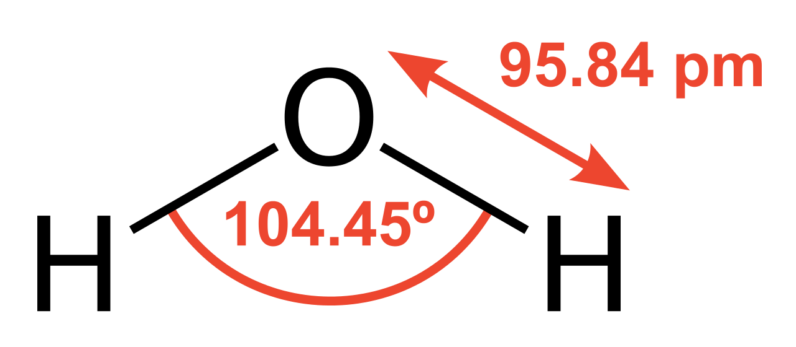

# Question 33

  - > Erlenmeyer flask

> 

  - > Volumetric
> flask

> 

# Question 40

  - > Strong + Strong --\> Weak + Weak

> 

# Question 42

  - > The order of Boiling point: HF \> HI \> HBr \> HCl

> ![Now, it must intuitively be certain that more the number of
> electrons then more the amount of London dispersion forces. This is
> true; the more the electrons the atom has, the stronger the amount of
> London dispersion forces and hence greater the attraction. The greater
> the attraction, the more energy you have to put to break the bonds
> apart. If you see the trend above, Iodine has more electrons than
> Bromine hence has a greater attraction force between its atoms hence
> has a greater boiling point. Similar for the case of Bromine and
> Chlorine. Hence, you can place the order of their boiling points as:
> Hence, HI \> HBr \> HCI ](./media/image164.png)
> 
> ![However, you notice an anomaly; HF should have a boiling point below
> that of HCI, then how come it has the highest boiling point? After
> all, Fluorine has lesser electrons than Chlorine and hence should have
> lesser London dispersion forces between them. This is true but there
> is another reason behind that: Hydrogen Bonding. Picture fluorine; it
> sits right above the other halogens. It belongs to Period 2 which does
> not have many shells to itself. Since it has so less electrons, it
> must be very small. In fact, it is. Fluorine is so small yet it has a
> really high charge density. Why does it have a high charge density?
> Its outer electrons are not as shielded by the inner electrons and it
> has 7 outer electrons. (read more on: Shielding effect t) These seven
> electrons face tremendous attraction from its nucleus hence it
> 'shrinks'. This causes the fluorine atom to shrink hence its charge
> density increases. As such, it can attract other electrons to itself
> when it is covalently bonded to another element. This property is
> called electronegativity. Now, this effect is very strong in case of
> smaller atoms like Fluorine. When fluorine is bonded with Hydrogen, it
> attracts certain portion of the bonded electrons to itself. This
> effect is strong enough that it stays like that permanently but since
> the electrons are always moving, it must mean that the electrons love
> to spend more 'time' with fluorine than hydrogen. When this happens, a
> permanent dipole is created since the electrons are not evenly
> distributed. As such, two charges are created in the two ends: ö+ and
> 5— ](./media/image165.png)
> 
> 
> 
> ![As you know, charges attract each other. Since the fluorine atom is
> so electronegative, this charge difference must be very great. Since
> the difference is so great, this attraction effect is very strong. As
> such, these molecules of HF start to 'clump' together (since they
> attract each other) in what is known as hydrogen bonding. Hydrogen
> bonding is the attraction between highly electronegative atoms with
> hydrogen bonded covalently. This attraction is stronger than London
> dispersion forces hence the presence of a hydrogen bond significantly
> raises the boiling point of the compound. Hence, HF has the highest
> boiling point amongst the four compounds. ](./media/image167.png)

# Question 65

  - > Calorimetry

> 

# Question 71

> 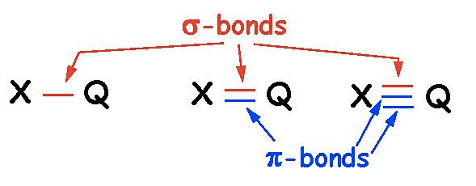
> 
> 

 

 

2013 Free Response

Tuesday, April 4, 2017

9:42 PM

 

# Question 1 (a)

  - > Write the state of each substance for dissolving equation

> 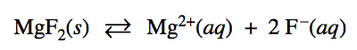
> 
> ![The Solubility Expression AaBb(s) aAb+ (aq) + bBa- (aq) Ksp =
> \[Ab+\]a \[Ba-\]b Example:Pb12 (s) Pb2+ + 21- Ksp = \[Pb2+1 \[I-r
> \*The greater the ksp the more soluble the solid is in 1-120.
> ](./media/image172.png)

# Question 1 (b)

> ![(ii) Calculate the minimum concentration of F-(aq) necessary to
> initiate precipitation of the salt selected in part (b)(i). 3.5 = =
> 3.5 x 10-10 = \[F-\]2 -10 = 10-5M 3.5 x 10 1 point is earned for the
> correct value of \[F - \]. ](./media/image173.png)

# Question 3 (c)

> ![(c) Calculate the magnitude of q, the thermal energy change, when
> the MgO was added to the 1.0 M HCl(aq). Include units with your
> answer. - mcAT q calorimeter In trial 2, OR In trial 3, OR In trial 4,
> q cal = q cal = q cal = (4.18 Jh 1.0 g) 100.0 mL x + 0.50 g mL ) (
> 4.18 Jh 1.0 g) 100.0 mL x + 0.25 g mL ) ( 4.18 J h 1.0 g h ) (4.00
> 100.0 mL x + 0.50 g mL ) c c c ) = 1700 Jor 1.7kJ ) = 880 JorO.88kJ 1
> point is earned for the correct mass of the solution. 1 point is
> earned for the correct calculation of q for any frial with a valid AT
> and ) = 1700 Jor 1.7kJ correct units.
> ](./media/image174.png)

# Question 3 (e)

> 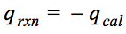

# Question 4 (a)

> 

  - > Write ionic equation if possible

# Question 5 (a)

> 

# Question 5 (e)

> 

# Question 6 (c)

> 

# Question 6 (e)

  - > hydrogen
> bonding

> 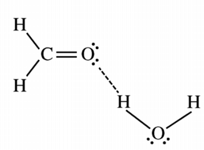
> 
> 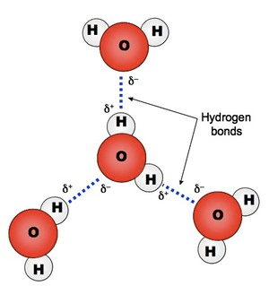

 

 

2014 Multiple Choice

Saturday, April 15, 2017

10:22 PM

 

# Question 3

> 
> 
> ![The first ionization energy varies in a predictable way across the
> periodic table. The ionization energy decreases from top to bottom in
> groups, and increases from left to right across a period. Thus, helium
> has the largest first ionization energy, while francium has one of the
> lowest. • From top to bottom in a group, orbitals corresponding to
> higher values of the principal quantum number (n) are being added,
> which are on average further away from the nucleus. Since the
> outermost electrons are further away, they are less strongly attracted
> by the nucleus, and are easier to remove, corresponding to a lower
> value for the first ionization energy. • From left to right across a
> period, more protons are being added to the nucleus, but the number of
> electrons in the inner, lower-energy nuclear char — the sum of the
> charges on the protons in the nucleus and the charges on the inner,
> core electrons. The valence electrons are therefore held more tightly,
> the atom decreases in size (see atomic radius), and it becomes
> increasingly difficult to remove them, corresponding to a higher value
> for the first ionization energy. ](./media/image183.png)

# Question 4

  - > Sealed rigid vessel = constant volume

> ![There are two cases on which equilibrium depends. These are:
> Addition of an inert gas at constant volume: When an inert gas is
> added to the system in equilibrium at constant volume, the total
> pressure will increase. But the concentrations of the products and
> reactants (i.e. ratio of their moles to the volume of the container)
> Hence, when an inert gas is added to the system in equilibrium at
> constant volume there will be no effect on the equilibrium. Addition
> of an inert gas When an inert gas is added to the system in
> equilibrium at constant pressure, then the total volume will increase.
> Hence, the number of moles per unit volume of various reactants and
> products will decrease. Hence, the equilibrium will shift towards the
> direction in which there is increase in number of moles of gases.
> ](./media/image184.png)

# Question 6

> 

# Question 12

> ![Ionization Energies for Period 2 Main Grou Elements Element Lithium
> (Li) Beryllium (Be) Boron (B) Carbon (C) Ni trogen (N) Oxygen (O)
> Fluorine (F) Neon (Ne) Electron Configuration \[He\] 2sl \[He\] 2s
> \[He\] 2s 2P \[He\] 2s 2P \[He\] 2s 2P \[He\] 2s 2P \[He\] 2s 2P
> Ionization Energy 520 kJ/m01 899 kJ/m01 801 kJ/m01 1086 kJ/m01 1400
> kJ/m01 1314 kJ/m01 1680 kJ/m01 2081 kJ/m01 @ 000 2s @ 000 2s
> ](./media/image186.png)
> 
> ![Why the drop between groups 5 and 6 (N-O and P-S) ? Once again, you
> might expect the ionisation energy of the group 6 element to be higher
> than that of group 5 because of the extra proton. What is offsetting
> it this time? N 1s22s22px12py12pz1 1st I.E. 1400 kJ mol-I 0
> 1s22s22px22py12pz1 1st I.E. 1310 kJ mol-I The screening is identical
> (from the 1s2 and, to some extent, from the 2s2 electrons), and the
> electron is being removed from an identical orbital. The difference is
> that in the oxygen case the electron being removed is one of the 2px2
> pair. The electrons in the same orbital means that the electron is
> easier to be. The drop in ionisation energy at sulphur is accounted
> for in the same way. ](./media/image187.png)

# Question 27

> 
> 
> 

# Question 30

  - > Common Hydgron bonds: H-O, H-N

> 
> 
> 

# Question 38

> 
> 
> 

# Question 40

> 

# Question 49

> ![Trend \#2 — For molecules with a given functional group, boiling
> point increases with molecular weight. Look at the dramatic increases
> in boi ing points as you increase molecular weight in all of these
> series: In a given series, boiling point increases with molecular
> weight. Why? Boiling point -42 oc ALCOHOLS HO Boiling point CIDS
> Boiling point Boiling oint 97 ac 141 oc -24 oc HO 117 oc Ha 164 oc 35
> ac 36 •c HO 138 oc Ha 186 oc 89 ac 69 •c 158 oc Ha 202 oc Increasing
> surface area gives rise to increased Van Der Waals interactions Here's
> the question: How, exactly do intermolecular forces increase as
> molecular weight increases? Well, the key force that is acting here
> are Van der Waals dispersion forces, which are proportional to surface
> area. So as you increase the length of the chain, you also increase
> the surface area, which means that you increase the ability of
> individual molecules to attract each other. ](./media/image194.png)

 

 

2014 Free Response

Thursday, April 6, 2017

8:42 PM

 

# Question 1 (a)

> 

# Question 2 (a)

> 

# Question 3 (c)

> 
> 
> 
> 
> 

# Question 3 (e)

> 
> 
> 

# Question 4 (c)

> ![(c) After 20 minutes some C02(g) was injected into the container,
> initially raising the pressure to 1.5 atm. Would the final pressure
> inside the container be less than, greater than, or equal to 1.04 atm?
> Explain your reasoning. The final pressure would be equal to 1.04 atm.
> Equilibrium was reached in both experiments; the equilibrium pressure
> 1 point is earned for the correct at this temperature is 1.04 atm. As
> the reaction shifts toward answer with justification. the reactant,
> the amount of C02(g) in the container will ecrease until the pressure
> returns to 1.04 a ](./media/image202.png)

# Question 5 (b)

> 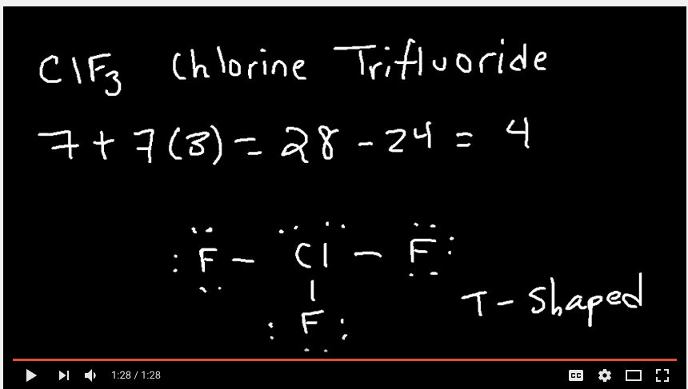
> 
> 

# Question 6 (b)

> ![CH3 Propene Vinyl Chloride (chloroethene) (b) The boiling point of
> liquid propene (226 K) is lower than the boiling point of liquid vinyl
> chloride (260 K). Account for this difference in terms of the types
> and strengths of intermolecular forces present in each liquid. Both
> substances have dipole-dipole interactions and London dispersion
> forces (or propene is essentially nonpolar with only LDFs while vinyl
> chloride has both LDFs and dipole-dipole forces). Propene contains a
> CH3 group, but vinyl chloride contains a Cl atom. Vinyl chloride thus
> has a larger electron cloud, is more polarizable, and has a larger
> dipole moment. Thus intermolecular attractions are stronger in vinyl
> chloride, which results in it having the higher boiling point. 1 point
> is earned for a discussion of intermolecular forces and for a
> comparison of their relative strengths. ](./media/image205.png)

# Question 7 (a)

> 
> 
> 
> 
> ![0.20 0.15 mol 1st half life 0.10 2nd 0.05 half life 0.00 Time, sec
> \[A\] vs time for a O order reaction alf life ecrease with decreasin
> concentration. 3td half life 20 40 60 80 ](./media/image208.png)
> 
> ![\[A\] vs time for a 1st order reaction 0.20 engtho hålf life I
> constan 4 st half life half life half life 0.00 Time, sec.
> ](./media/image209.png)
> 
> ![\[A\] vs time for a 2nd order reaction 0.20 Length of half life
> increases ith decreasing concentration. mol half half life half life
> 100 200 Time, sec. 300 400 ](./media/image210.png)
> 
> ![Half-Life The half-life ofa reaction, h n, is the time required for
> the concentration ofa reac- tant to reach half its initial value, \[A
> h 2 — Half-life is a convenient way to de- scribe how fast a reaction
> occurs, especially if it is a first-order process. A fast reaction has
> a short half-life. We can determine the half-life of a first-order
> reaction by substituting A = —kt1/2 ITC —kt1/2 Time A Figure 14.10
> Comparison of first-order and zero-order reactions for the
> disappearance of reactant A with time. for CA\] tand t1/2 for t in
> Equation 14.12: In — t1/2 = \[14.15\] k 0.693 k From Equation 14.15,
> we see that t1/2 for a first-order rate law does not depend on the
> initial concentration of any reactant. Consequently, the half-life
> remains constant throughout the reaction. If, for example, the
> concentration of a reactant is 0.120 M at some instant in the reac-
> tion, it will be M) = 0.060 M after one half-life. After one more
> half-life passes, the concentration will drop to 0.030 M, and so on.
> Equa- tion 14.15 also indicates that, for a first-order reaction, we
> can calculate t1/2 if we know k and calculate k if we know t1/2. The
> change in concentration over time for the first-order rearrange- ment
> of gaseous methyl isonitrile at 199 oc is graphed in Figure 14.11.
> Because the concentration of this gas is directly proportional to its
> pres- sure during the reaction, we have chosen to plot pressure rather
> than concentration in this graph. The first half-life occurs at 13,600
> s (3.78 h). At a time 13,600 s later, the methyl isonitrile pressure
> (and therefore, 150 75 h/2 37.5 10,000 20,000 Time (s) 30,000
> concentration) has decreased to half of one-half, or one-fourth, of
> the initial value. In a first-order reaction, the concentration of the
> reactant decreases by one-half in each of a series of regularly spaced
> time intervals, each interval equal to ti/2. A Figure 14.11 Kinetic
> data for the rearrangement of methyl isonitrile to acetonitrile at 199
> 'C, showing the half-life of the reaction. ](./media/image211.png)
> 
> ![The half-life for second-order and other reactions depends on
> reactant concentra- tions and therefore changes as the reaction
> progresses. We obtained Equation 14.15 for the half-life for a
> first-order reaction by substituting \[A h 2 = for \[A)tand ti/2 for t
> in Equation 14.12. We find the half-life of a second-oråer reaction by
> making the same substitutions into Equation 14.14: \[Alo — \[A\] 0 1 1
> — kt1/2 + 2 C A 10 1 = kt1/2 1 \[14.17\] In this case, the half-life
> depends on the initial concentration of reactant—the lower the initial
> concentration, the longer the half-life. ](./media/image212.png)

# Question 7 (c)

> ![(c) Is the initial rate of the reaction in trial 1 greater than,
> less than, or equal to the initial rate in trial 2 ? Justify your
> answer. The initial rate in trial 1 is less than that in trial 2
> because rate k \[cis-2-butene\] or rate kP cis-2-butene (with
> reference to values from both frials). OR because the initial
> concentration of cis-2-butene in trial 1 is less than that in trial 2
> and k is constant. 1 point is earned for the correct answer with
> justification. ](./media/image213.png)

# Question 7 (d)

> 

 

 

2015 Multiple Choice

Wednesday, April 19, 2017

12:35 AM

 

# Question 16

> 

# Question 21

  - > Dipole-induced dipole interaction

> 
> 
> 

# Question 29

  - > ΔH° = bond enthalpies for the bonds broken - bond enthalpies for
    > the bonds formed

> 

# Question 34

> 
> 
> 

# Question 43

  - > Intermediate should not be lower than products

> 

# Question 49

  - > Chromatography Experiment

> 
> 
> 
> 
> ![Rule of thumb: The component that travels the least distance on the
> TLC plate is the most polar, since it binds to the silica most
> tightly. The component that travels the is the least polar; it binds
> to the silica least tightly and is most soluble in the non-polar
> solvent (mobile phase), and hence moves up the plate with the solvent.
> So just by looking at a TLC plate, you can tell which component is
> more polar and which component is less polar. There is also a
> quantitative parameter, termed as retention factor (Rf) that can be
> calculated for every individual component and this value is very
> commonly used in the 'world of chemical syntheses'. This value is
> invariably reported in manuscripts so that people who replicate the
> synthesis of a compound can verify that they too are getting the same
> R f values for the same compounds. ](./media/image224.png)

# Question 50

  - > Electronic transition \< Molecular vibration \< Molecular rotation

> 
> 
> 

 

 

2015 Free Response

Thursday, April 6, 2017

4:36 PM

 

# Question 1 (c)

> ![(c) The zinc-air cell is taken to the top of a mountain where the
> air pressure is lower. (i) Will the cell potential be higher, lower,
> or the same as the cell potential at the lower elevation? The cell
> potential will be lower. 1 point is earned for indicating a lower cell
> potential. (ii) Justify your answer to part (c)(i) based on the
> equation for the overall cell reaction and the information above.
> 02(g), a reactant in the cell reaction, will be at a lower partial
> pressure at the higher elevation; thus the reaction has a ater value
> of closer to Deviations in partl pressure t att et e ce closer to
> equilibrium will decrease the magnitude of the cell potential. 1 point
> is earned for a justification that relates a lower pressure (or
> concentration) of 02(g) to Q, or a qualitative approach using e
> uation. ](./media/image227.png)
> 
> 
> 
> ![The Nernst Equation The effect of concentration on cell emf can be
> obtained from the effect of concentra- tion on free-energy change. ax:
> (Section 19.7) Recall that the free-energy change for any chemical
> reaction, AG, is related to the standard free-energy change for the
> reac- tion, AGO: AG = AGO + RT1nQ \[20.15\] The quantity Q is the
> reaction quotient, which has the form of the equilibrium-constant
> expression except that the concentrations are those that exist in the
> reaction mixture at ex-x-a (Section 15.6) a given moment. Substituting
> AG = —nFE (Equation 20.11) into Equation 20.15 gives nFE — -nFEO +
> RT1nQ Solving this equation for E gives the Nernst equation: In Q This
> equation is customarily expressed in terms of the base-IO logarithm:
> 2.303 RT log Q \[20.16\] \[20.17\] At T = 298 K, the quantity 2.303
> RT/F equals 0.0592, with units of volts, and so the Nernst equation
> simplifies to 0.0592 v logQ (T = 298 K) n \[20.18\]
> ](./media/image229.png)

# Question 2 (c)

> ![Relationship between AGO and K We can now use Equation 19.19 to
> derive the relationship between AGO and the equi- librium constant, K.
> At equilibrium, AG = 0 and Q = K. Thus, at equilibrium, Equa- tion
> 19.19 transforms as follows: AG = AGO + RT1nQ O = AGO + RT1nK AGO =
> -RT1nK \[19.20\] Equation 19.20 is a very important one, with broad
> significance in chemistry. By relating K to AGO, we can also relate K
> to entropy and enthalpy changes for a reaction.
> ](./media/image230.png)
> 
> ![We can also solve Equation 19.20 for K, to yield an expression that
> allows us to calculate K if we know the value of AGO: AGO In K -RT
> -AGO/RT \[19.21\] As usual, we must be careful in our choice of units.
> In Equations 19.20 and 19.21 we again express AGO in kJ/mol. In the
> equilibrium-constant expression, we use atmospheres for gas pressures,
> molarities for solutions; and solids, liquids, and solvents do not
> appear in the expression. (Section 15.4) Thus, the equi- librium
> constant is KP for gas-phase reactions and Kc for reactions in
> solution. Section 15.2 From Equation 19.20 we see that if AGO is
> negative, In K must be positive, which eans K \> 1. Therefore, the
> more negative AGO is, the larger K is. Conversely, if AGO is ositive,
> In K is negative, which means K \< 1. Finally, if AGO is zero, K = 1.
> ](./media/image231.png)

# Question 2 (e)

> 

# Question 2 (f)

> ![(f) During the dehydration experiment, C2H4(g) and unreacted
> C2H50H(g) passed through the tube into the water. The C2H4 was
> quantitatively collected as a gas, but the unreacted C2H50H was not.
> Explain this observation in terms of the intermolecular forces between
> water and each of the two gases. Ethene is only slightly soluble in
> water because the weak dipole/induced dipole intermolecular
> attractions between nonpolar ethene molecules and polar water
> molecules are weaker than the hydrogen bonds between water molecules.
> Ethanol molecules are soluble in water because they are polar and form
> hydrogen bonds with water molecules as they dissolve. I point is
> earned for comparing of ethene in water with the solubility of ethanol
> in water in terms of differences In olarit I point is earned for
> describing the intermolecular forces between ethene and water as weak
> di ole/induced di ole forces and attributing the solubility o et ano m
> water to the formed between ethanol molecules and water molecules.
> ](./media/image232.png)
> 
> 
> 
> 

# Question 4 (b)

> ![(b) Calculate the molar solubility of Ca(OH)2 Ksp = \[Ca2+\]
> \[OH-\]2 1.3 x 10-6 = (0.10 + x) (2x)2 (0.10) 4x2 1.3 x 10-5 = 4x2 x =
> 0.0018M Molar solubility of = 0.0018 M in 0.10 M \[assuming x \<\< O.
> 10\] I point is earned for the correct stoichiometry and setup. 1
> point is earned for the final answer. ](./media/image235.png)

# Question 6

  - > Anion: A Negative ION

  - > CATion: PAWSitive (cats have paws)

> 

# Question 7 (a)

> ![(a) Calculate the amount of heat needed to purify 1.00 mole of Al
> originally at 298 K by melting it. The melting point of Al is 933 K.
> The molar heat capacity of Al is 24 and the heat of fusion of Al is
> 10.7 kJ/moI. To raise the temperature from 298 K to 933 K: 24 J x 1.00
> mol x 635 15,000 J = 15 kJ mol K It takes 10.7 kJ to melt the Al at
> 933 K. 5 kJ + 10.7kJ = 26 kJ I point is earned for calculating the
> amount of heat needed to raise the temperature to 933 K. I point is
> earned fo addin the heat of fusion to the previous resu t to get a
> final answer. ](./media/image237.png)

 

 

2016 Free Response

Wednesday, April 5, 2017

6:50 PM

 

# Question 1 (a)

> 

# Question 1 (c)

> 

# Question 1 (d)

> 

# Question 1 (f)

> ![(f) The lattice enthalpy of LiCl is positive, indicating that it
> takes energy to break the ions apart. in LiCl. However, the
> dissolution of LiCl in water is an exothermic process. Identify all
> particle-particle interactions that contribute significantly to the
> exothermic dissolution process being exothermic. For each interaction,
> include the particles that interact and the specific type of
> intermolecular force between those particles. There are interactions
> between Li+ ions and polar water molecules and between Cl- ions and
> polar water molecules. These ar ion-dipole interactions. 1 point is
> earned for identifying the particles that interact. 1 point is earned
> for correctly identifying the type of interaction.
> ](./media/image241.png)
> 
> 
> 
> 

# Question 2 (e)

> 

# Question 2 (f)

> ![(f) A student prepares a solution containing equimolar amounts of
> HC2H302 and NaC2H302. The pH of the solution is measured to be 4.7.
> The student adds two drops of 3.0 M HN03(aq) and stirs the sample,
> observing that the pH remains at 4.7. Write a balanced, net-ionic
> equation for the reaction between HN03(aq) and the chemical species in
> the sample that is responsible for the pH remaining at 4.7. C2H302- +
> H30+ HC2H302 + H20 OR C2H302- + H+ HC2H302 I point is earned for a
> correct equation. ](./media/image245.png)
> 
> 

# Question 3 (d)

> ![(d) Explain why 12 is a solid at room temperature whereas Br2 is a
> liquid. Your explanation should clearly reference the types and
> relative strengths of the intermolecular forces present in each
> substance. Both Br2 and 12 molecules are nonpolar molecules, therefore
> the only possible intermolecular forces are London dispersion forces.
> The London dispersion forces are stronger in 12 because it is larger
> in size with electron cloud. The stronger London dispersion forces in
> 12 result in a higher melting point,which makes 12 a solid at room
> temperature. 1 point is earned for identifying the forces in each
> substance as London dispersion forces. 1 point is earned for
> explaining why the forces are stronger in 12 than in Br2 .
> ](./media/image247.png)

# Question 5 (b)

> ![Zeroth Order First Order Second Order Differential rate law
> Concentration vs. time Integrated rate law Straight-line plot to
> determine rate constant Relative rate vs. concentration Half-life
> Units of k, rate constant Rate = o o o o ALA\] At Time Slope = —k Time
> Rate — o o ALA\] = MA\] At Time o o —kt or Slope = —k Time \[A\], M
> Rate, M/S o o o o 2 3 M Rate, M/s 2k 2 3 Rate = 2 3 A\[A\] = At Time
> Slope = k Time Rate, M/S 4 9 2 3 0.693 l/s ](./media/image22.png)
> 
> 
> 
> 

# Question 6 (a)

> ![(a) Considering the value of K for the reaction, determine the
> concentration of Ba(EDTA)2-(aq) in the 100.0 mL of solution. Justify
> your answer. Based on the K value, the reaction goes essentially to
> Ba2+(aq) is the limiting reactant. The concentration of Ba2+ when the
> solutions are first mixed but before any reaction takes place is 0.20
> M/2 = 0.10 M. Thus the equilibrium concentration of Ba(EDTA)2-(aq) is
> 0.10M. 1 point is earned for indicating that the equilibrium
> concentration of Ba(EDTA)2-(aq) is the same as the original
> concentration of Ba2+ when the solutions are mixed. 1 point is earned
> for the concentration with appropriate calculations.
> ](./media/image248.png)

# Question 7 (a)

  - > Since your buret is graduated to 0.1 mL, you will read your buret
    > to 0.01 ml. The second decimal place is an estimate, but should be
    > recorded.

 

 

Practice Test Multiple Choice

2017年2月8日 星期三

下午 12:05

 

# Question 4

  - > Potassium Chromate is a **yellowish**, crystalline
> compound.

> 

# Question 10

  - > First Ionization Energy: He \> Ne \> Ar \> Kr \> Xe

> 

# Question 15

  - > A typical Lewis acid-base reaction:

> 

# Question 23

> 
> 
> 

  - > For the process of solid calcium chloride **dissolving in water**,
    > the **entropy** change is **negative** since **water molecules**
    > in the hydration shells of Ca2+ and Cl- ions are **more ordered**
    > than they are in the pure water

# Question 28

> 

# Question 30

> 
> 
> 

# Question 34

  - > **N2H4** exhibits **significant hydrogen bonding** in the liquid
    > state.

> 

# Question 37

> 

# Question 38

  - > Calculate standard cell potential for the galvanic cell:

> 

# Question 40

  - > Beta plus decay vs Beta minus
> decay

> 
> 
> 

# Question 47

> ![Zeroth Order First Order Second Order Differential rate law
> Concentration vs. time Integrated rate law Straight-line plot to
> determine rate constant Relative rate vs. concentration Half-life
> Units of k, rate constant Rate = o o o o ALA\] At Time Slope = —k Time
> Rate — o o ALA\] = MA\] At Time o o —kt or Slope = —k Time \[A\], M
> Rate, M/S o o o o 2 3 M Rate, M/s 2k 2 3 Rate = 2 3 A\[A\] = At Time
> Slope = k Time Rate, M/S 4 9 2 3 0.693 l/s ](./media/image22.png)
> 
> 
> 
> 

# Question 51

  - > **O3** contains bonds that have a **bond order** of
> **1.5**

> 
> 
> 

# Question 67

> 

# Question 71

  - > **Endothermic**: **Separation** of solute and solvent

  - > **Exothermic**: Intermolecular attractions **form** between solute
    > and solvent

> 
> 
> 

 

 

Princeton 1 Multiple Choice

2017年2月8日 星期三

下午 9:55

# Question 3

# Question 9

  - > In an **electrochemical reaction**, as the reaction progress, the
    > **voltage** of the cell will **decrease** because with a lower
    > concentration, the number of electrons that are being transferred
    > will decrease

# Question 12

  - > **SF4** has an **asymmetrical** molecular structure

> 

# Question 16

> 

# Question 17

> 
> 
> ![计算机生成了可选文字: Henderson-Hasselbalch Equation \[A \] pH = pKa + 《 og
> \[HAJ \[HA\] ConJ ugate Base Weak Acid ](./media/image272.png)

  - > At the **half-equivalence point**, the last part of the
    > Henderson-Hasselbalch equation cancels out, leaving **pH=pKa**

# Question 20

> 

# Question 21

> 

# Question 23

  - > **Buffer = a week acid/base + its salt**

# Question 27

  - > With the same amount of limiting reactant, adding more excessive
    > reactant will not change the value for H, but the change in
    > temperature will decrease for the increase in overall mass

# Question 38 

  - > At **low temperatures** or **high pressures**, real gases
    > **deviate** significantly from ideal gas behavior.

# Question 49

  - > The **overall** rate law is always equal to the **rate law** for
    > the **slowest** elementary step, which can be determined using the
    > **coefficients** of the **reactants**. In this case, rate =
    > k\[NO2\]\[F2\]. To get the overall order, we **add** the
    > **exponents** in the rate law. 1+1 = 2

# Question 53

  - > Lower vapor pressure = weaker IMFs

  - > IMFs:
    
      - > polar \> nonpolar
    
      - > with hydrogen bonding \> without hydrogen bonding

# Question 55

  - > If both nonpolar, **more electron** = **more polarizable** =
    > stronger IMFs = higher boiling point

# Question 60

> 

  - > **Substitutional** alloys have **similar**, **reduced
    > malleability** and **ductility** to interstitial alloys and have
    > densities that typically lay between the densities of the
    > component metals

 

 

Princeton 2 Multiple Choice

2017年2月8日 星期三

下午 10:12

 

# Question 11

  - > The **further away** an electron is from the nucleus, the **less
    > binding energy** that the incoming photons need to overcome, and
    > as a result, the **more** **kinetic energy** the electron will
    > have after it is ejected.

# Question 20

> ![Photoelectron Spectroscopy PES 1 1 1.36 0.80 Ionization Energy
> (MJ/mol) • The shell model does not separate the 8 electrons in n = 2.
> But The PES for boron does not support that. • PES data tells us that
> the model must be revised, as the n = 2 shell must contain 2 subshells
> with different IE. • Each peak corresponds to a subshell or sublevel.
> H: 1 electron in n = 1 He: 2 electrons in n = 1 Li: 2 electrons in n =
> 1 and 1 electrons in n = 2 Be: 2 electrons in n = 1 and 2 electrons in
> n = 2 Ele+onic B: 2 electrons in n = 1, 2 electrons in n = 2, 2s and 1
> electron in 2pSttmcture ](./media/image276.png)
> 
> 

# Question 21

> The **bond length** always corresponds to the point where the
> **potential bond** **energy** (a balance of the attraction and
> repulsion forces between the two atoms) is at it’s **minimum** value.

  - > 

# Question 23

  - > **Weak acids resist changes in pH** more effectively than strong
    > atoms because so many molecules of weak acid are **undissociated**
    > in solution. The base must cause those molecules to dissociate
    > before affecting the pH significantly.

# Question 25

  - > When calculating enthalpy, the **total energy** is always the
    > **bonds broken** (reactants) **minus** the **bonds formed**
    > (products). The more positive this value is, the more energy there
    > is in the reactants compared to the products.

> 

# Question 36

  - > The outermost **s-block** electrons in a **transition metal** tend
    > to be **lost** before the d-block electrons
> do.

# Question 40

> 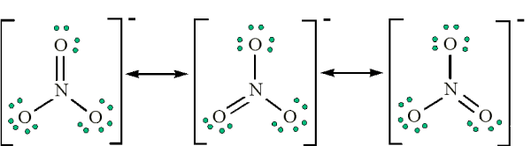
> 
> 
> 
> 

# Question 44

> 
> 
> 

# Question 49

> 
> 
> 
> 
> 

# Question 53

> 

# Question 55

  - > The strength of an atom’s **magnetic moment** increases with an
    > increase in the number of **unpaired electrons**.

# Question 60

> 
> 
> 
