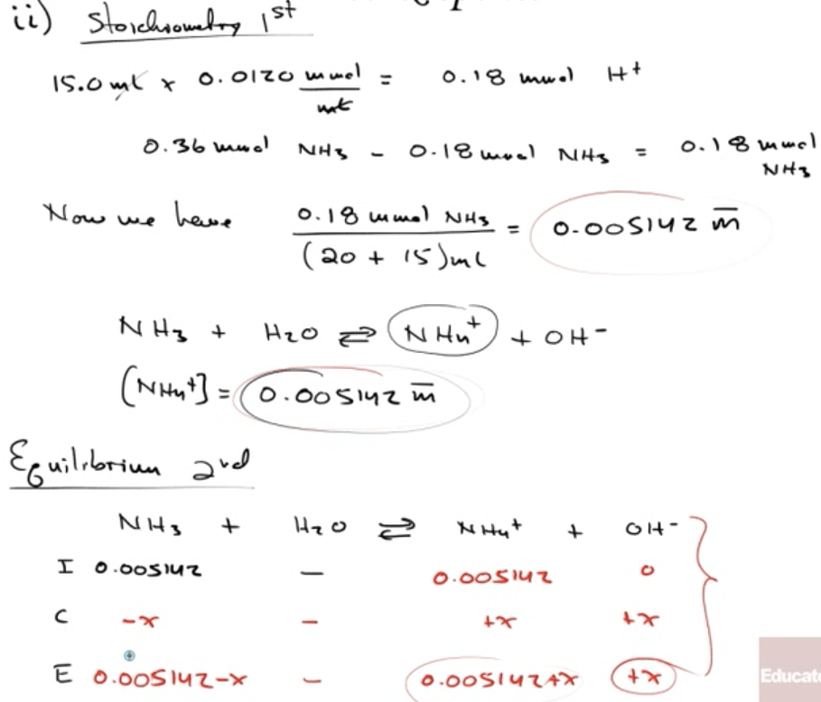
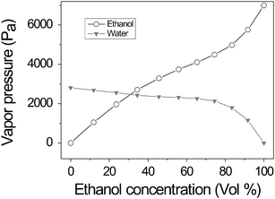

# Question 1 (c)

 ![Using Ka to Calculate pH Knowing the value of Ka and the initial
 concentration of a weak acid, we can calculate the concentration of
 H+(aq) in a solution of the acid. Lees calculate the pH at 25 oc of a
 0.30 M solution of acetic acid (CH3COOH), the weak acid responsible
 for the charac- teristic odor and acidity of vinegar. 1. Our first
 step is to write the ionization equilibrium: CH3COOH(aq) H+(aq) +
 CH3COO (aq)  16.28  Notice that the hydrogen that ionizes is the one
 attached to an oxygen atom. 2. The second step is to write the
 equilibrium-constant expression and the value for the equilibrium
 constant. Taking Ka = 1.8 X 10 5 from Table 16.2, we write 5 = 1.8 x
 10  CH3COOH   16.29  3. The third step is to express the
 concentrations involved in the equilibrium reac- tion. This can be
 done with a little accounting, as described in Sample Exercise 16.10.
 Because we want to find the equilibrium value for l, let's call this
 quan- tity x. The concentration of acetic acid before any of it
 ionizes is 0.30 M. The chem- ical equation tells us that for each
 molecule of CH3COOH that ionizes, one H+(aq) and one CH3COO (aq) are
 formed. Consequently, if x moles per liter of H+(aq) form at
 equilibrium, x moles per liter of rnust also form and x moles per
 liter of CH3COOH rnust be ionized: ](./media/image28.png)
 
 ![Initial concentration (M) Change in concentration (M) Equilibrium
 concentration (M) CH3COOH(aq) 0.30 —x (0.30 - x) H+(aq) x CH3COO (aq)
 x 4. The fourth step is to substitute the equilibrium concentrations
 into the equilibrium- constant expression and solve for x: 5 = 1.8 x
 10  CH3COOH1 0.30 — x  16.30  This expression leads to a quadratic
 equation in x, which we can solve by using either an equation-solving
 calculator or the quadratic formula. We can simplify the problem,
 however, by noting that the value of Ka is quite small. As a result,
 we anticipate that the equilibrium lies far to the left and that x is
 much smaller than the initial concentration of acetic acid. Thus we
 assume that x is ne li ible relative to 0.30 so that 0.30 — x is
 essentiall e ual to 0.30. We can (and should\!) check the validity of
 this assumption when we finish the problem. By using this assumption,
 Equation 16.30 becomes — @ = 1.8 X 10 5 0.30 ](./media/image29.png)
 
 
 
 ![Now we check the validity of our simplifying assumption that 0.30 —
 x 0.30. The value of x we determined is so small that, for this number
 of significant figures, the assumption is entirely valid. We are thus
 satisfied that the assumption was a reasonable one to make. Because x
 represents the moles per liter of acetic acid that ionize, we see
 that, in this particular case, less than 1% of the acetic acid
 molecules ionize: 0.0023 M Percent ionization of CH3COOH — x 100% =
 0.77% 0.30 M As a general rule, if x is more than about 5% of the
 initial concentration value, it is better to use the quadratic
 formula. You should always check the validity of any simplifying
 assumptions after you have finished solving a problem. We have also
 made one other assumption, namely that all of the in the solution
 comes from ionization of CH3COOH. Are we justified in neglecting the
 autoionization of H20? The answer is yes—the additional  H+  due to
 water, which would be on the order of 10 7 M, is negligible compared
 to the  H+  from the acid (which in this case is on the order of 10
 3 M). In extremely precise work, or in cases involving very dilute
 solutions of acids, we would need to consider the autoionization
 ofwater more fully. ](./media/image31.png)

# Question 1 (e)

 
 
 
 
 
 
 

# Question 2 (b)

 
 
 
 
 ![The positive charge holding the electron is greater for He+, which
 has a 2+ nucleus, than for H with its 1+ nucleus. The stronger
 attraction means that it requires more energyl pt for the electron to
 move to higher energy levels. Therefore, transitions from high energy
 states to lower states will be more energetic for He + than for H.
 Note: Other arguments accepted, such as, "E is proportional to Z 2.
 Since Z = 2 for He and Z = 1 for H, all energy levels in He + are
 raised (by a factor of 4)." Other accepted answers must refer to the
 increased gharge on the He+ nucleus, and NOT the mass.
 ](./media/image38.png)

# Question 3 (b)

 ![Reaction Orders: The Exponents in the Rate Law The rate law for most
 reactions has the form Rate = kreactant 1 lmrreactant 21M ...
 14.8 The exponents m and n are called reaction orders. For
 example, consider again the rate law for the reaction of NH4+ with N02
 Rate = Because the exponent of NH4+ is 1, the rate is first order
 in NH4+. The rate is also first order in N02— . (The exponent 1 is not
 shown in rate laws.) The overall reaction order is the sum of the
 orders with respect to each reactant represented in the rate law.
 Thus, for the NH4+ — N02— reaction, the rate law has an overall
 reaction order of 1 + 1 = 2, and the reaction is second order overall.
 The exponents in a rate law indicate how the rate is affected by each
 reactant con- centration. Because the rate at which NH4+ reacts with
 N02— depends on C NH4+ raised to the first power, the rate doubles
 when NH4+l doubles, triples when r NH4+l triples, and so forth.
 Doubling or tripling r N02— likewise doubles or triples the rate. If a
 rate law is second order with respect to a reactant, r A 12, then
 doubling the concentration of that substance causes the reaction rate
 to quadruple because 212 = 4, whereas tripling the concentration
 causes the rate to increase ninefold: 31 The following are some
 additional examples of experimentally determined rate laws: 2 N205(g)
 4 N02(g) + 02(g) Rate = kCN205 H2(g) + 12(g) 2 Hl(g) Rate = 14.9
 14.10 CHC13(g) + C12(g) CC14(g) + HC1(g) Rate = 14.11 Although
 the exponents in a rate law are sometimes the same as the coefficients
 in the balanced equation, this is not necessarily the case, as
 Equations 14.9 and 14.11 show. For any reaction, the rate law must be
 determined experimentally. In most rate laws, reac- tion orders are 0,
 1, or 2. However, we also occasionally encounter rate laws in which
 the reaction order is fractional (as is the case with Equation 14.11)
 or even negative. ](./media/image39.png)
 
 

# Question 3 (d)

 ![Mechanisms with a Slow Initial Step We can most easily see the
 relationship between the slow step in a mechanism and the rate law for
 the overall reaction by considering an example in which the first step
 in a multistep mechanism is the rate-determining step. Consider the
 reaction of N02 and CO to produce NO and CO, (Equation 14.23). Below
 225 oc, it is found experi- mentally that the rate law for this
 reaction is second order in NO, and zero order in CO: Rate = k N0212.
 Can we propose a reaction mechanism consistent with this rate law?
 Consider the two-step mechanism:\* N03(g) + NO(g) (slow) step 1:
 N02(g) + N02(g) Step 2: N03(g) + CO(g) N02(g) + C02(g) (fast) Overall:
 N02(g) + CO(g) NO(g) + C02(g) Step 2 is much faster than step 1; that
 is, k2 >> kl, telling us that the intermediate N03(g) is slowly
 produced in step 1 and immediately consumed in step 2. Because step 1
 is slow and step 2 is fast, step 1 is the rate-determining step. Thus,
 the rate of the overall reaction depends on the rate of step 1, and
 the rate law of the ](./media/image41.png)
 
 ![overall reaction equals the rate law of step 1. Step 1 is a
 bimolecular process that has the rate law Rate = Thus, the rate law
 predicted by this mechanism agrees with the one observed experi-
 mentally. The reactant CO is absent from the rate law because it
 reacts in a step that follows the rate-determining step. A scientist
 would not, at this point, say that we have "proved" that this mecha-
 nism is correct. All we can say is that the rate law predicted by the
 mechanism is consistent with experiment. We can often envision a
 different sequence of steps that leads to the same rate law. If,
 however, the predicted rate law of the proposed mecha- nism disagrees
 with experiment, we know for certain that the mechanism cannot be
 correct. ](./media/image42.png)

# Question 5 (d)

 

# Question 6 (b)

 ![(b) (i)The reaction rate depends on the reaction kinetics which is
 determined by the value of the activation energy, Eact. If the
 activation energy is large, a reaction that is thermodynamically
 spontaneous may proceed very slowly (if at all). One point eamed for
 linking the rate of the reaction to the activation energy, which may
 be explained verbally or shown on a reaction profile diagram (ii) The
 catalyst has no effect on the value of AGO. The catalyst reduces the
 value of Eact, increasing the rate of reaction, but has no effect on
 AHO and ASO, so it cannot affect the thermodynamics of the reaction.
 One point eamed for indicating no change in the value of AGO One point
 eamed for indicating (verbally, or with a reaction-profile diagram)
 that the catalyst affects the activation energy 1 pt 1 pt the values
 of 1 pt ](./media/image44.png)

# Question 7 (b)

 

# Question 7 (c)

 
 
 
 
 

# Question 7 (d)

 

# Question 8 (b)

 