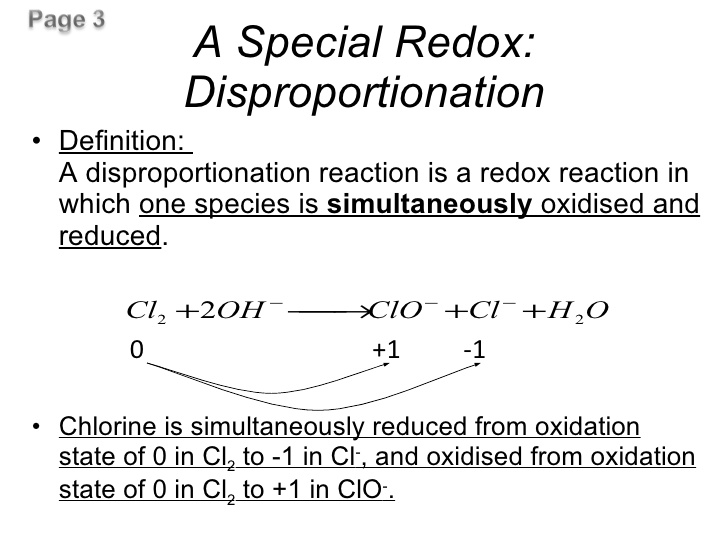
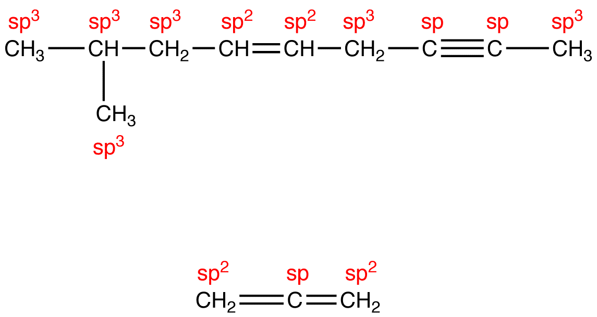
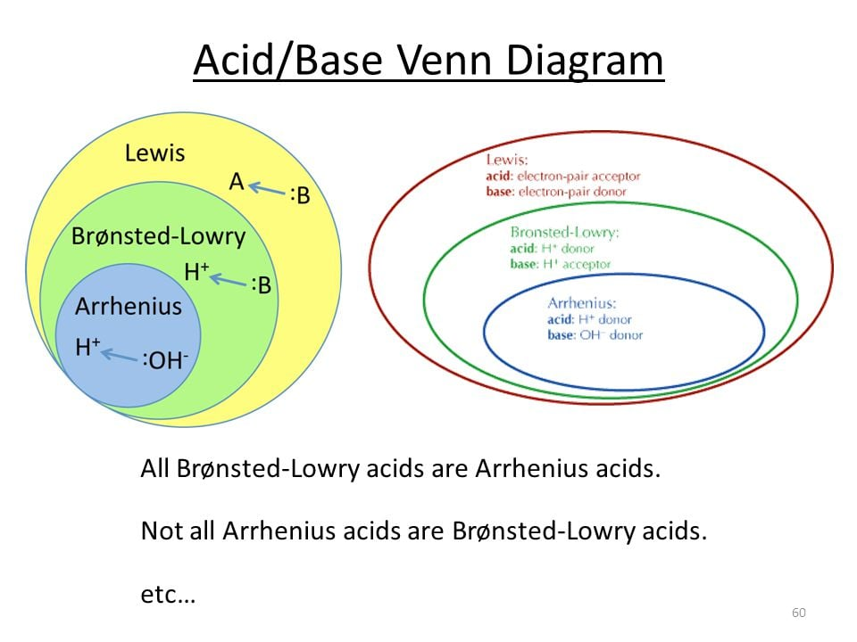
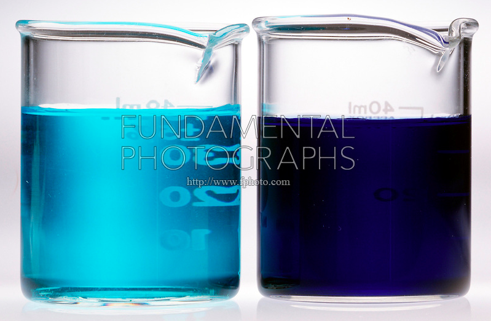
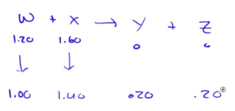
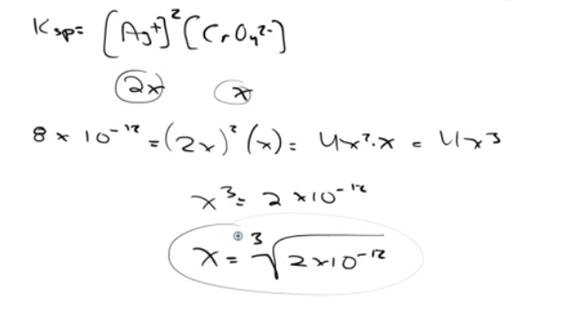
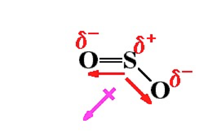

# Question 4

 ![计算机生成了可选文字: The principal reason ionic compounds are stable is the
 attraction between ions Of opposite charge. This attraction draws the
 ions together ， releasing energy and causing the ions to form a solid
 array ， or lattice ， such as that shown in Figure 8 ． 3 ． A measure of
 how much stabilization results 什 om arranging oppositely charged ions
 in an ionic solid is given by the lattice energy ， which is the “ “ 罗
 required co e 纱 separate 0 ” e mole Ofa solid io CO PO d 仂 its g eo io
 ． TO envision this process for NaCl, imagine that the structure in
 Figure 8 ． 3 expands from within ， SO that the distances between the
 ions increase until the ions are very far apart. This process requires
 788 kJ/moI, which is the value of the lattice energy: NaC1(s) -- - 一 十
 (g) + Cl-(g) AHIattice = +788kJ/moI \[ 8 ． 3 \] ](./media/image6.png)
 
 

# Question 9-12

  -  Buffer
    
      -  Weak Acid + Its Congregate Base
    
      -  Weak Base + Its Congregate Acid

# Question 13-16

# Question 23

# Question 27

  -  A visible-light **spectrophotometer** can determine the
     **concentration** of a solution

 
 
  
 
 

# Question 30

# Question 31

 

# Question 32

# Question 35

 

# Question 38

# Question 39

  -  The **normal melting point** of a solid is defined as the
     temperature at which the solid and liquid are in equilibrium at a
     total pressure of 1 atmosphere.

# Question 43

  -  When **excess ammonia** is added to a solution of Cu(NO3)2, the
     color of blue will be **darker**.

  -  Cu(NO3)2 + 4NH3 = \[Cu(NH3)4\]\](NO3)2

 

  -  Adding Ammonia To Copper II Nitrate.

  -  (left) Solution of blue Cu(NO3)2\*6H2O (complex ion is Cu(H2O)6
     +2).

  -  (right) Addition of NH3(aq) forms deep blue complex ion
     \[Cu(NH3)4(H2O)2\]2+.

# Question 53

 
 
 

# Question 54

 

# Question 56

 

# Question 57

  -  The **standard reduction potential** is an **intrinsic** property.
     It will **not change** by the coefficient.

# Question 63

# Question 54

 
 
 

# Question 70

# Question 72

 

# Question 74

  -  **SO2** is a **polar** molecule, so it will **deviate** from
     **ideal**
 behavior.

 