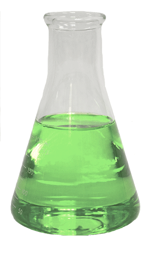

# Question 10

  -  Highest ionization energy: He

 

# Question 11

  -  Ni2+ is light
 green

 
 
 

# Question 15

  -  Lewis acid-base reaction and coordination complex

 
 
 

# Question 28

 
 
 

# Question 34

  -  Hydrogen bonding in
 N2H4

 

# Question 40

  -  Beta plus decay vs. Beta minus decay

 

# Question 71

 
 
 
 
 