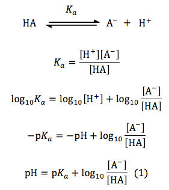
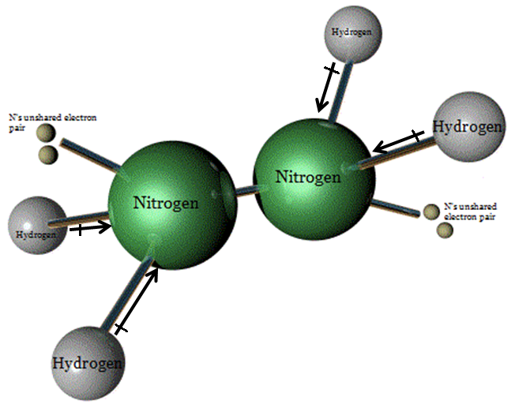
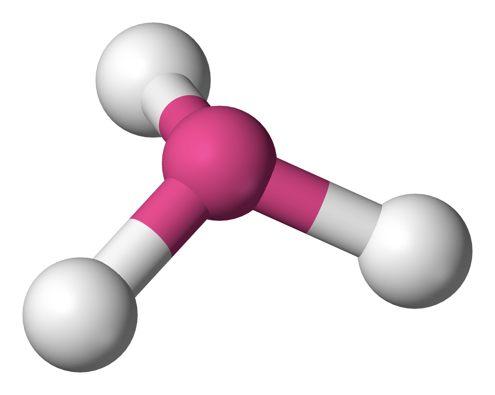

# Question 1 (c)

 
 
 ![(ii) The contents of beaker 2 are poured into beaker 3 and the
 resulting solution is stirred. Assume that volumes are additive.
 Calculate the pH of the resulting solution. In the resulting solution,
 \[NH3\] = \[NH'\] , Ka = 5.6 X 10-10 \[NH4+\] Thus \[H30+\] = 5.6 x
 10-10; pH = -log(5.6 x 10-10) 1 point is earned for noting that the
 solution is a buffer with \[NH3\] = \[NH'\]. 1 point is eamed for the
 correct pH. = 9.25 ](./media/image119.png)

  -  Henderson–Hasselbalch equation

 

# Question 1 (d)

 ![(ii) Calculate the final \[NH4+\] in the resulting solution at 250C.
 moles = (volume)(molarity) moles H30+ in sol 1 . = = 0.00250 mol moles
 NH3 in 2 = = 0.00250 mol moles NH4+ in sol 3 . = = 0.00250 mol When
 the solutions are mixed, the H30+ and NH3 react to form NH + resulting
 in a total of 0.00500 mol NH 4 +. The final volume is the sum
 (25.0+25.0+25.0) = 75.0mL. The final concentration of NH + = (0.00500
 mol/O.0750L) = 0.0667 M. 1 point is earned for the correct calculation
 of moles of NH 4. 1 point is eamed for the correct calculation of the
 final volume and concentration. ](./media/image121.png)

# Question 2 (a)

  -  Your answers should have the same decimal places as the equipment
     can read

 

  -  Procedure for preparing solutions

 ![(ii) Briefly list the steps of an appropriate and safe procedure for
 preparing the 50. mL of 6 MHN03. Only materials selected from those
 provided to the student (listed above) may be used. Wear safe o les
 and rubber loves. Then measure 19 mL of 16 O using a 100 mL graduated
 cylinder. Measure 31 mL of distille H O using a 100 mL graduated
 cylinder. Transfer the water to a 100 mL beaker. Add the acid to the
 water with stirring. 1 point is earned for properly measuring the
 volume of 16 MHN03 and preparing a 6 MHN03 acid solution. 1 point is
 earned for wearing protective gear and for adding acid to water.
 ](./media/image123.png)

  -  Volumetric flask vs. Graduated cylinder

 

# Question 3 (a)

  -  Notice the **coefficient** of the reactants and products in
     calculating standard enthalpy change

  -  Standard enthalpy of formation of **pure elements** in their
     standard states are assigned **zero**

 ![2 H2(g) + 02(g) 2 H20(1) (a) Calculate the standard enthalpy change,
 AHO for the reaction represented by the equation above. 298 (The molar
 enthalpy of formation, AH AH0298 = - \[2(0) + 1(0)\] ; , for H20(1) is
 -285.8 kJ mol-I at 298 K.) = -571.6kJ mol-I 1 point is earned for the
 correct answer. ](./media/image125.png)

# Question 5 (b)

 

  -  N2H4 molecular geometry

 

  -  Trigonal
 pyramidal

 

# Question 5 (c)

 ![(c) The normal boiling point of N2H4 is 1140C, whereas the normal
 boiling point of C2H6 is —890C. Explain, in terms of the
 intermolecular forces present in each liquid, why the boiling point of
 N2H4 is so much higher than that of C2H6. N2H4 is a polar molecule
 with London dispersion forces, forces, and hydrogen bonding between
 molecules, whereas C2H6 is nonpolar and only has London dispersion
 forces between molecules. It takes more energy to overcome the
 stronger IMFs in 1 point is earned for correct reference to the two
 different types of IMFs. 1 point is earned for a valid explanation
 based on the relative strengths of the IMFs. hydrazine, resulting in a
 higher boiling point. ](./media/image129.png)
 
 

# Question 6 (b)

 ![(b) The flask is then heated to 450C, and the pressure in the flask
 increases. In terms of kinetic molecular theory, provide TWO reasons
 that the pressure in the flask is greater at 450C than at 350C. There
 are three possible reasons based on kinetic molecular theory. • At the
 higher temperature there are more, ethanol molecules in the gas phase,
 so there will be more collisions with the flask walls, resulting in a
 greater pressure. 1 point is earned for each • At the higher
 temperature the molecules will be moving faster on correct reason up
 to a maximum average, thus colliding with the flask walls more
 frequently, of 2 points. resulting in a greater pressure. • Because
 the molecules are moving faster on average, their collisions with the
 flask walls will exert a greater force, resulting in a greater
 pressure. ](./media/image131.png)