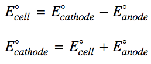

# Question 1 (e)

 ![assume that х << 0.200 М (0.200- х) ' х = \[Нзо+\] = З.5ХШ-3 М рн
 --1од\[НзО+\] = -log(3.5x10-3) - 2.45 ](./media/image149.png)

# Question 3 (b)

  -  ΔH° = enthalpy of bonds broken - enthalpy of bonds formed

 

# Question 3 (d)

 

# Question 5 (c)

 ![(c) 12(s) and Br2(l) can react to form the compound IBr(I). Predict
 which would have the greater molar enthalpy of vaporization, IBr(l) or
 Br2(l). Justify your prediction. IBr(I). Two reasons may be given.
 First, IBr is polar, and dipole-dipole forces would tend to increase
 the enthalpy of vaporization. Second, IBr should have stronger London
 dispersion forces because of the greater number of electrons in the
 larger IBr molecule. 1 point is earned for the correct choice with
 either or both of the acceptable reasons. ](./media/image152.png)

# Question 5 (d)

 ![(d) Explain why the hexane layer is light purple while the water
 layer is virtually colorless. Your explanation should reference the
 relative strengths of interactions between molecules of 12 and the
 solvents H20 and C H and the reasons for the differences. The hexane
 layer is purple because most of the 12 is dissolved in it. The
 entrance of the 12 into water requires disruption of the hydrogen
 bonds in water, which are much stronger than the London dispersion
 forces in hexane. Meanwhile, the London dispersion forces between 12
 and hexane would be stronger than the London dispersion forces between
 I and water. (Water and 12 can also interact through a dipole-induced
 dipole force, but this attraction is insufficient to overcome the
 other differences noted above.) 1 point is earned for recognizing from
 the experimental observations that the iodine dissolved in the hexane.
 1 point is earned for a correct explanation referencing the
 differences between water and hexane in their interactions with 12.
 ](./media/image153.png)

# Question 5 (e)

 
 
 

# Question 6 (c)

 

# Question 6 (e)

 ![(i) A student bumps the cell setup, resulting in the salt bridge
 losing contact with the solution in the cathode compartment. Is V
 equal to 0.47 or is V equal to 0? Justify your choice. V 0 V. The
 transfer of ions through the salt bridge will stop. A charge imbalance
 between the half-cells will prevent electrons from flowing through the
 wire. 1 point is earned for the correct choice with an appropriate
 explanation. (ii) A student spills a small amount of 0.5 M Na2S04(aq)
 into the compartment with the Pb electrode, resulting in the formation
 of a precipitate. Is V less than 0.47 or is V greater than 0.47 ?
 Justify your choice. V > 0.47 V. The sulfate ion will react with the
 Pb2+ ion to form a precipitate. This results in a thermodynamically
 favored anode half-cell reaction and hence a larger potential
 difference. The choice may also be justified using the Nernst
 equation. 1 point is earned for the correct choice with an appropriate
 explanation. cell RT \[Pb2+\] cell — nF \[Cu2+\] Decreasing the
 \[Pb2+\] will increase the cell voltage. ](./media/image157.png)
 
 ![(iii) After the laboratory session is over, a student leaves the
 switch closed. The next day, the student opens the switch and reads
 the voltmeter. Is V less than 0.47 or is V equal to 0.47? Justify your
 choice. V < 0.47 V. Over time, \[Pb2+\] increases and \[Cu2+\]
 decreases, making both half-cell reactions less thermodvnamicallv
 favorable. The choice may also be justified using the Nernst equation.
 Increasing \[Pb2+\] and decreasing \[Cu2+\] decreases the cell
 voltage. The choice may also be justified by stating that the voltage
 is zero as a result of the establishment of equilibrium. 1 point is
 earned for the correct choice with an appropriate explanation.
 ](./media/image158.png)