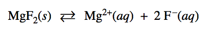
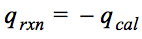
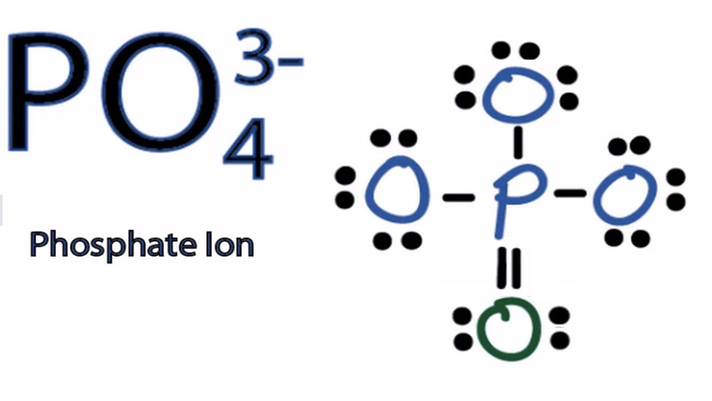
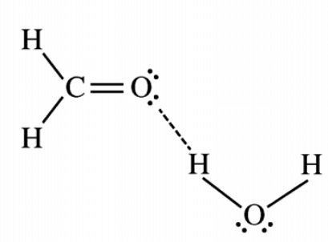
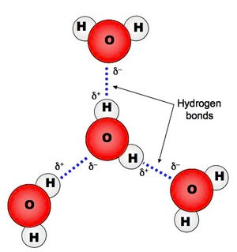

# Question 1 (a)

  -  Write the state of each substance for dissolving equation

 
 
 ![The Solubility Expression AaBb(s) aAb+ (aq) + bBa- (aq) Ksp =
 \[Ab+\]a \[Ba-\]b Example:Pb12 (s) Pb2+ + 21- Ksp = \[Pb2+1 \[I-r
 \*The greater the ksp the more soluble the solid is in 1-120.
 ](./media/image172.png)

# Question 1 (b)

 ![(ii) Calculate the minimum concentration of F-(aq) necessary to
 initiate precipitation of the salt selected in part (b)(i). 3.5 = =
 3.5 x 10-10 = \[F-\]2 -10 = 10-5M 3.5 x 10 1 point is earned for the
 correct value of \[F - \]. ](./media/image173.png)

# Question 3 (c)

 ![(c) Calculate the magnitude of q, the thermal energy change, when
 the MgO was added to the 1.0 M HCl(aq). Include units with your
 answer. - mcAT q calorimeter In trial 2, OR In trial 3, OR In trial 4,
 q cal = q cal = q cal = (4.18 Jh 1.0 g) 100.0 mL x + 0.50 g mL ) (
 4.18 Jh 1.0 g) 100.0 mL x + 0.25 g mL ) ( 4.18 J h 1.0 g h ) (4.00
 100.0 mL x + 0.50 g mL ) c c c ) = 1700 Jor 1.7kJ ) = 880 JorO.88kJ 1
 point is earned for the correct mass of the solution. 1 point is
 earned for the correct calculation of q for any frial with a valid AT
 and ) = 1700 Jor 1.7kJ correct units.
 ](./media/image174.png)

# Question 3 (e)

 

# Question 4 (a)

 

  -  Write ionic equation if possible

# Question 5 (a)

 

# Question 5 (e)

 

# Question 6 (c)

 

# Question 6 (e)

  -  hydrogen
 bonding

 
 
 