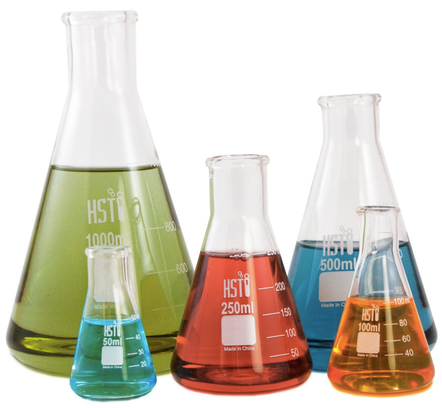

# Question 6

  -  Bond angle

 
 
 

# Question 33

  -  Erlenmeyer flask

 

  -  Volumetric
 flask

 

# Question 40

  -  Strong + Strong --> Weak + Weak

 

# Question 42

  -  The order of Boiling point: HF > HI > HBr > HCl

 ![Now, it must intuitively be certain that more the number of
 electrons then more the amount of London dispersion forces. This is
 true; the more the electrons the atom has, the stronger the amount of
 London dispersion forces and hence greater the attraction. The greater
 the attraction, the more energy you have to put to break the bonds
 apart. If you see the trend above, Iodine has more electrons than
 Bromine hence has a greater attraction force between its atoms hence
 has a greater boiling point. Similar for the case of Bromine and
 Chlorine. Hence, you can place the order of their boiling points as:
 Hence, HI > HBr > HCI ](./media/image164.png)
 
 ![However, you notice an anomaly; HF should have a boiling point below
 that of HCI, then how come it has the highest boiling point? After
 all, Fluorine has lesser electrons than Chlorine and hence should have
 lesser London dispersion forces between them. This is true but there
 is another reason behind that: Hydrogen Bonding. Picture fluorine; it
 sits right above the other halogens. It belongs to Period 2 which does
 not have many shells to itself. Since it has so less electrons, it
 must be very small. In fact, it is. Fluorine is so small yet it has a
 really high charge density. Why does it have a high charge density?
 Its outer electrons are not as shielded by the inner electrons and it
 has 7 outer electrons. (read more on: Shielding effect t) These seven
 electrons face tremendous attraction from its nucleus hence it
 'shrinks'. This causes the fluorine atom to shrink hence its charge
 density increases. As such, it can attract other electrons to itself
 when it is covalently bonded to another element. This property is
 called electronegativity. Now, this effect is very strong in case of
 smaller atoms like Fluorine. When fluorine is bonded with Hydrogen, it
 attracts certain portion of the bonded electrons to itself. This
 effect is strong enough that it stays like that permanently but since
 the electrons are always moving, it must mean that the electrons love
 to spend more 'time' with fluorine than hydrogen. When this happens, a
 permanent dipole is created since the electrons are not evenly
 distributed. As such, two charges are created in the two ends: ö+ and
 5— ](./media/image165.png)
 
 
 
 ![As you know, charges attract each other. Since the fluorine atom is
 so electronegative, this charge difference must be very great. Since
 the difference is so great, this attraction effect is very strong. As
 such, these molecules of HF start to 'clump' together (since they
 attract each other) in what is known as hydrogen bonding. Hydrogen
 bonding is the attraction between highly electronegative atoms with
 hydrogen bonded covalently. This attraction is stronger than London
 dispersion forces hence the presence of a hydrogen bond significantly
 raises the boiling point of the compound. Hence, HF has the highest
 boiling point amongst the four compounds. ](./media/image167.png)

# Question 65

  -  Calorimetry

 

# Question 71

 
 
 