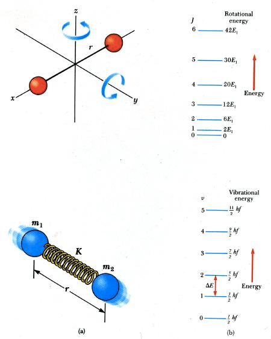

# Question 16

 

# Question 21

  -  Dipole-induced dipole interaction

 
 
 

# Question 29

  -  ΔH° = bond enthalpies for the bonds broken - bond enthalpies for
     the bonds formed

 

# Question 34

 
 
 

# Question 43

  -  Intermediate should not be lower than products

 

# Question 49

  -  Chromatography Experiment

 
 
 
 
 ![Rule of thumb: The component that travels the least distance on the
 TLC plate is the most polar, since it binds to the silica most
 tightly. The component that travels the is the least polar; it binds
 to the silica least tightly and is most soluble in the non-polar
 solvent (mobile phase), and hence moves up the plate with the solvent.
 So just by looking at a TLC plate, you can tell which component is
 more polar and which component is less polar. There is also a
 quantitative parameter, termed as retention factor (Rf) that can be
 calculated for every individual component and this value is very
 commonly used in the 'world of chemical syntheses'. This value is
 invariably reported in manuscripts so that people who replicate the
 synthesis of a compound can verify that they too are getting the same
 R f values for the same compounds. ](./media/image224.png)

# Question 50

  -  Electronic transition < Molecular vibration < Molecular rotation

 
 
 