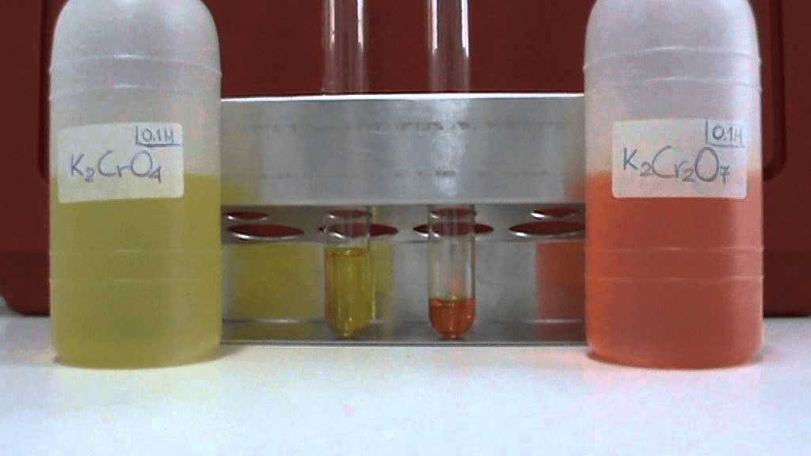
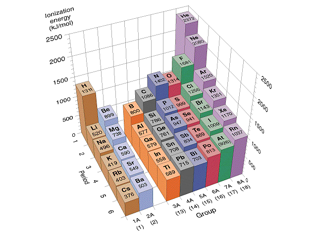
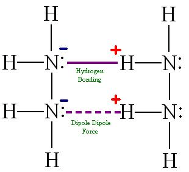
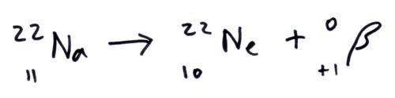
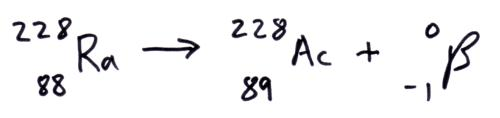

# Question 4

  -  Potassium Chromate is a **yellowish**, crystalline
 compound.

 

# Question 10

  -  First Ionization Energy: He > Ne > Ar > Kr > Xe

 

# Question 15

  -  A typical Lewis acid-base reaction:

 

# Question 23

 
 
 

  -  For the process of solid calcium chloride **dissolving in water**,
     the **entropy** change is **negative** since **water molecules**
     in the hydration shells of Ca2+ and Cl- ions are **more ordered**
     than they are in the pure water

# Question 28

 

# Question 30

 
 
 

# Question 34

  -  **N2H4** exhibits **significant hydrogen bonding** in the liquid
     state.

 

# Question 37

 

# Question 38

  -  Calculate standard cell potential for the galvanic cell:

 

# Question 40

  -  Beta plus decay vs Beta minus
 decay

 
 
 

# Question 47

 ![Zeroth Order First Order Second Order Differential rate law
 Concentration vs. time Integrated rate law Straight-line plot to
 determine rate constant Relative rate vs. concentration Half-life
 Units of k, rate constant Rate = o o o o ALA\] At Time Slope = —k Time
 Rate — o o ALA\] = MA\] At Time o o —kt or Slope = —k Time \[A\], M
 Rate, M/S o o o o 2 3 M Rate, M/s 2k 2 3 Rate = 2 3 A\[A\] = At Time
 Slope = k Time Rate, M/S 4 9 2 3 0.693 l/s ](./media/image22.png)
 
 
 
 

# Question 51

  -  **O3** contains bonds that have a **bond order** of
 **1.5**

 
 
 

# Question 67

 

# Question 71

  -  **Endothermic**: **Separation** of solute and solvent

  -  **Exothermic**: Intermolecular attractions **form** between solute
     and solvent

 
 
 
