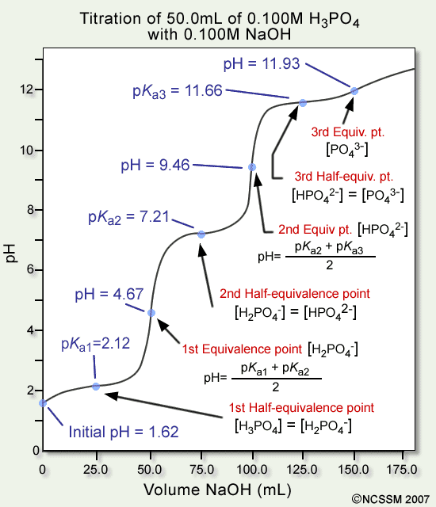

# Question 3

# Question 9

  -  In an **electrochemical reaction**, as the reaction progress, the
     **voltage** of the cell will **decrease** because with a lower
     concentration, the number of electrons that are being transferred
     will decrease

# Question 12

  -  **SF4** has an **asymmetrical** molecular structure

 

# Question 16

 

# Question 17

 
 
 ![计算机生成了可选文字: Henderson-Hasselbalch Equation \[A \] pH = pKa + 《 og
 \[HAJ \[HA\] ConJ ugate Base Weak Acid ](./media/image272.png)

  -  At the **half-equivalence point**, the last part of the
     Henderson-Hasselbalch equation cancels out, leaving **pH=pKa**

# Question 20

 

# Question 21

 

# Question 23

  -  **Buffer = a week acid/base + its salt**

# Question 27

  -  With the same amount of limiting reactant, adding more excessive
     reactant will not change the value for H, but the change in
     temperature will decrease for the increase in overall mass

# Question 38 

  -  At **low temperatures** or **high pressures**, real gases
     **deviate** significantly from ideal gas behavior.

# Question 49

  -  The **overall** rate law is always equal to the **rate law** for
     the **slowest** elementary step, which can be determined using the
     **coefficients** of the **reactants**. In this case, rate =
     k\[NO2\]\[F2\]. To get the overall order, we **add** the
     **exponents** in the rate law. 1+1 = 2

# Question 53

  -  Lower vapor pressure = weaker IMFs

  -  IMFs:
    
      -  polar > nonpolar
    
      -  with hydrogen bonding > without hydrogen bonding

# Question 55

  -  If both nonpolar, **more electron** = **more polarizable** =
     stronger IMFs = higher boiling point

# Question 60

 

  -  **Substitutional** alloys have **similar**, **reduced
     malleability** and **ductility** to interstitial alloys and have
     densities that typically lay between the densities of the
     component metals