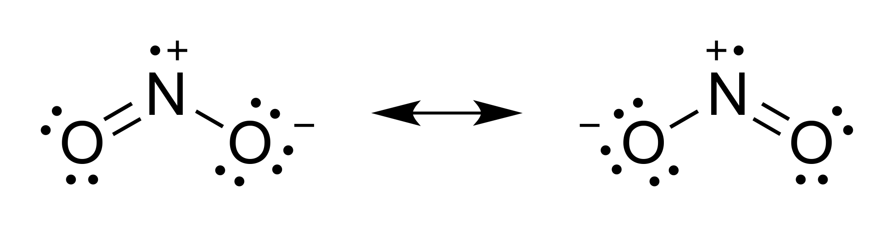

# Question 11

  -  The **further away** an electron is from the nucleus, the **less
     binding energy** that the incoming photons need to overcome, and
     as a result, the **more** **kinetic energy** the electron will
     have after it is ejected.

# Question 20

 ![Photoelectron Spectroscopy PES 1 1 1.36 0.80 Ionization Energy
 (MJ/mol) • The shell model does not separate the 8 electrons in n = 2.
 But The PES for boron does not support that. • PES data tells us that
 the model must be revised, as the n = 2 shell must contain 2 subshells
 with different IE. • Each peak corresponds to a subshell or sublevel.
 H: 1 electron in n = 1 He: 2 electrons in n = 1 Li: 2 electrons in n =
 1 and 1 electrons in n = 2 Be: 2 electrons in n = 1 and 2 electrons in
 n = 2 Ele+onic B: 2 electrons in n = 1, 2 electrons in n = 2, 2s and 1
 electron in 2pSttmcture ](./media/image276.png)
 
 

# Question 21

 The **bond length** always corresponds to the point where the
 **potential bond** **energy** (a balance of the attraction and
 repulsion forces between the two atoms) is at it’s **minimum** value.

  -  

# Question 23

  -  **Weak acids resist changes in pH** more effectively than strong
     atoms because so many molecules of weak acid are **undissociated**
     in solution. The base must cause those molecules to dissociate
     before affecting the pH significantly.

# Question 25

  -  When calculating enthalpy, the **total energy** is always the
     **bonds broken** (reactants) **minus** the **bonds formed**
     (products). The more positive this value is, the more energy there
     is in the reactants compared to the products.

 

# Question 36

  -  The outermost **s-block** electrons in a **transition metal** tend
     to be **lost** before the d-block electrons
 do.

# Question 40

 
 
 
 
 

# Question 44

 
 
 

# Question 49

 
 
 
 
 

# Question 53

 

# Question 55

  -  The strength of an atom’s **magnetic moment** increases with an
     increase in the number of **unpaired electrons**.

# Question 60

 
 
 
